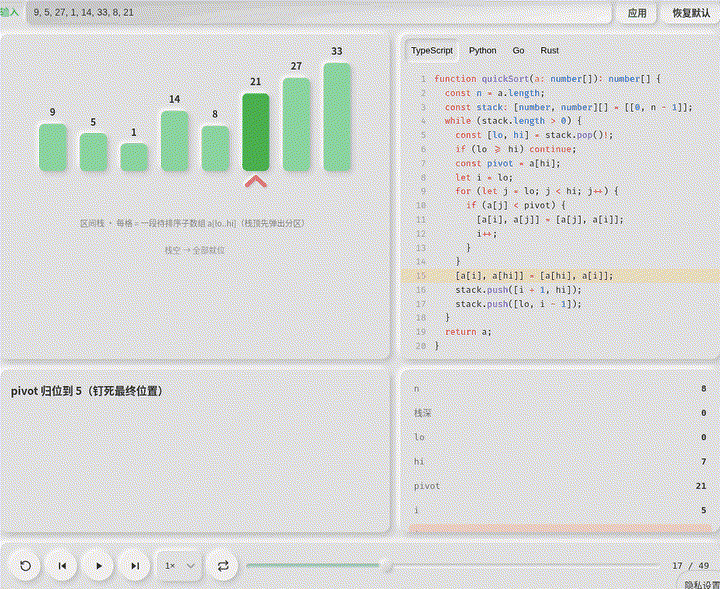
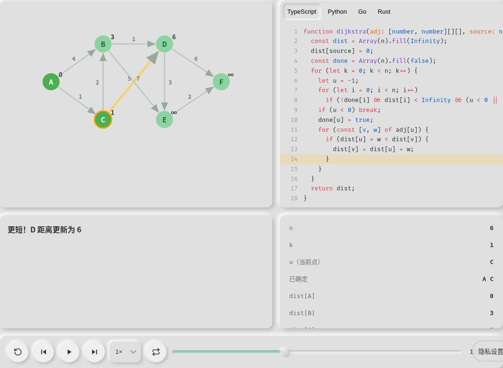
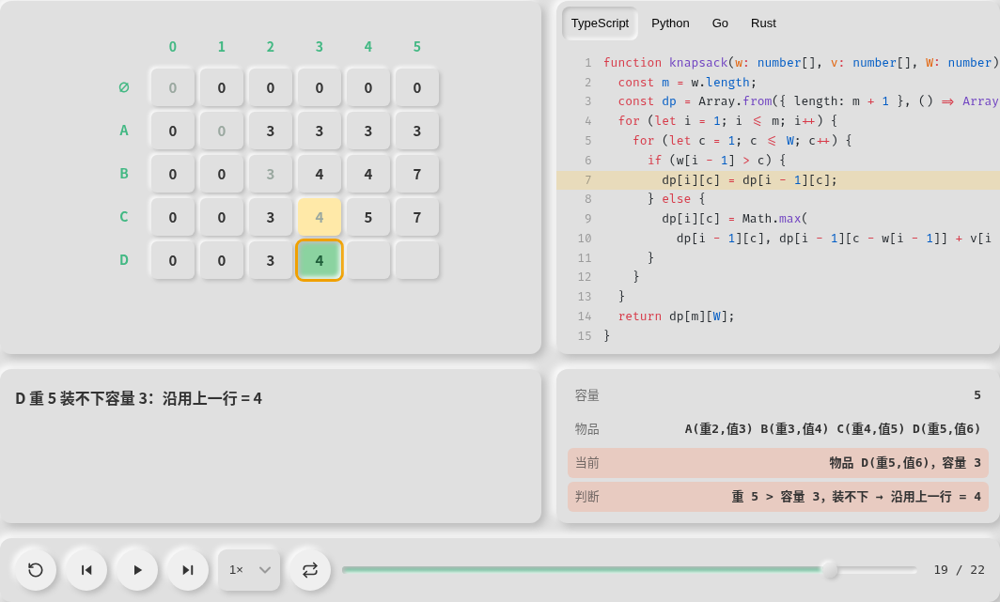
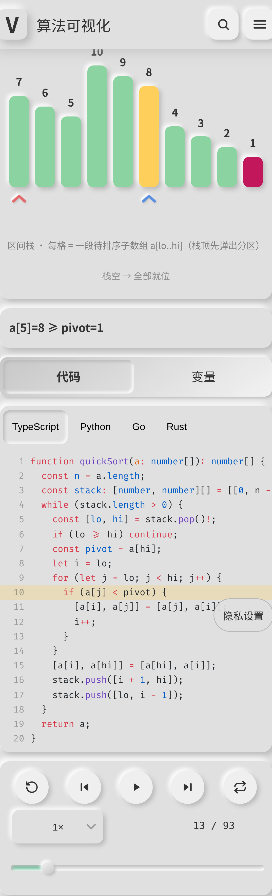

[中文](README.md)

# Algorithm Visualizer

Watch each algorithm run one step at a time. The catalog has 92 entries in nine categories. Seventy-seven algorithm pages replay those steps with TypeScript, Python, Go, and Rust highlighted line by line. Fifteen introductory data-structure pages are interactive playgrounds.

**Try it: https://algo.illegalscreed.cn/** (mirror: https://illegalcreed.github.io/algorithms-visualization/)



## Features

- **Replayable animation**: step forward and back, scrub the timeline, 0.5× / 1× / 2× / 3× speed, loop, and ← → Space
- **Four languages in sync**: TypeScript, Python, Go, and Rust, with the current line highlighted, a variable panel, and a caption for each step
- **Custom input**: 12 sorting modules accept your own array, write it to `?input=`, and keep the link shareable
- **Quizzes**: Binary Search and Quick Sort pause on key steps and ask a question
- **Study tools**: ⌘K / Ctrl+K search and a complexity reference. The Chinese site has four paths (Getting Started, Interview Favorites, Graph Theory, Advanced Topics). The English site groups the same catalog into eight routes: Foundations, Sorting Systems, Graph Structure, Dynamic Programming, Backtracking, String Structure, Number Theory, and Geometry
- **Chinese and English, including a mobile layout**

## Catalog (92 entries, 9 categories)

| Category                | Count | Entries                                                                                                                                                                                                                                                               |
| ----------------------- | ----- | --------------------------------------------------------------------------------------------------------------------------------------------------------------------------------------------------------------------------------------------------------------------- |
| Data Structures         | 16    | Array, Linked List, Stack, Queue and Deque, Binary Search Tree, Binary Heap, Hash Table, Graph, Trie, Disjoint Set Union, LRU Cache, Skip List, Segment Tree, B+ Tree, Bloom Filter, Fenwick Tree                                                                     |
| Sorting                 | 16    | Bubble Sort, Cocktail Shaker Sort, Bitonic Sort, Selection Sort, Insertion Sort, Binary Insertion Sort, Shell Sort, Merge Sort, Top-Down Merge Sort, Quick Sort, Three-Way Quick Sort, Dual-Pivot Quick Sort, Heap Sort, Counting Sort, Radix Sort, Bucket Sort       |
| Graph Algorithms        | 12    | Dijkstra's Shortest Path, Kruskal's Minimum Spanning Tree, Prim's Minimum Spanning Tree, Bellman-Ford Shortest Paths, Topological Sort, Floyd-Warshall, Strongly Connected Components, 2-SAT, Maximum Flow, Bipartite Matching, Lowest Common Ancestor, Eulerian Path |
| Dynamic Programming     | 11    | Edit Distance, 0/1 Knapsack, Unbounded Knapsack, Longest Common Subsequence, Longest Increasing Subsequence, Coin Change, Stone Merging, Traveling Salesperson DP, Tree Dynamic Programming, Digit DP, Rerooting DP                                                   |
| Backtracking and Search | 9     | N-Queens, Subsets, Permutations, Combination Sum, Maze Solving with DFS, Number of Islands, Word Search, Sudoku Solver, A\* Search                                                                                                                                    |
| Strings                 | 8     | KMP String Matching, Rabin-Karp String Matching, Boyer-Moore String Matching, Manacher's Longest Palindromic Substring, Suffix Array, LCP Array, Aho-Corasick Automaton, Z Function                                                                                   |
| Math and Number Theory  | 10    | Sieve of Eratosthenes, Linear Sieve, Euclidean Algorithm, Binary Exponentiation, Extended Euclidean Algorithm, Chinese Remainder Theorem, Euler's Totient Function, Miller-Rabin Primality Test, Fast Fourier Transform, Pollard's Rho Factorization                  |
| Computational Geometry  | 5     | Convex Hull, Rotating Calipers, Closest Pair of Points, Line Segment Intersection, Bentley-Ottmann Sweep Line                                                                                                                                                         |
| Searching               | 5     | Binary Search, Lower and Upper Bound, Search in a Rotated Sorted Array, Binary Search on the Answer, Ternary Search                                                                                                                                                   |

## Screenshots

| Home                                  | Dijkstra                                                    | 0/1 Knapsack                                                       |
| ------------------------------------- | ----------------------------------------------------------- | ------------------------------------------------------------------ |
|  |  |  |



## Quick start

Node.js 22 (the same major version as CI) and pnpm via corepack. The pnpm version is pinned in the `packageManager` field of `package.json`.

```bash
corepack enable
pnpm install
pnpm dev          # local development
pnpm test:unit    # Vitest
pnpm test:e2e     # Playwright
pnpm build        # type-check, production build, and prerender
```

## How it is built

- Vue 3 (`<script setup>`), TypeScript, Vite, Pinia, and Less. Runtime dependencies are Vue, Vue Router, Pinia, and Shiki
- Each of the 77 player algorithms is `xxx.ts` (an oracle), `xxx.module.ts` (a `Step[]` snapshot builder), and `xxx.sources.ts` (four languages plus an execution-point to line-number map). Fenwick Tree uses that player. The other 15 data-structure pages are interactive demos
- `AlgorithmPlayer` only replays snapshots. Twenty tracks — bars, trees, graphs, matrices, boards, mazes, character tapes, and others — render when the current step includes that field
- After the build, Playwright prerenders 190 pages: 95 in Chinese and 95 in English (92 catalog entries, plus home, the complexity reference, and learning paths)

## Related projects

[VisuAlgo](https://visualgo.net/), [algorithm-visualizer](https://github.com/algorithm-visualizer/algorithm-visualizer), [Hello 算法](https://github.com/krahets/hello-algo)

## License

[MIT](LICENSE)
