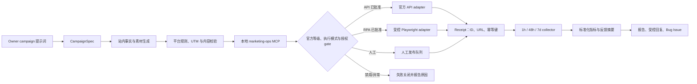

# 渠道全自动能力审计

> Status: active
> Owner: IllegalCreed
> Created: 2026-07-11
> Last reviewed: 2026-07-11
> Current implementation: C127 T3-B 已完成固定 GitHub CLI、只读授权/仓库健康、显式 activation 与惰性 runtime；本机 health ready，但 adapter disabled、真实发布为零
> Execution source: `docs/marketing/execution-backlog.md`

## 目的

本文件回答一个具体问题：Owner 只给一次 campaign 提示词后，哪些渠道能通过受支持的官方能力完成内容生成、发布、监测、反馈归纳和允许范围内的回复。

官方能力结论只依据截至 2026-07-11 可核验的官方文档、当前仓库配置和平台公开规则。账号价值高低不改变接口是否受支持。后续实现可在独立本地 MCP 内使用逐渠道批准的受控 RPA，但这不会提升平台的官方能力等级，也不能使用内部接口、Cookie 导出、stealth、验证码绕过或明文密码托管。

## “全自动”的项目定义

完成一次性账号接入后，Owner 可以只发送类似下面的提示词：

> 推广“快速排序可视化”：中英双语，发布到所有已授权自动渠道，2026-07-12 20:00 JST 开始；生成平台原生文案和素材，48 小时与 7 天复盘；常见问题按批准策略回复，Bug 反馈建 GitHub Issue。

系统随后应自动完成：

1. 把提示词规范化为 `CampaignSpec`，读取站内页面、标题、描述、截图和 UTM 规则。
2. 为每个平台生成独立文案与媒体清单，执行链接、长度、标签、语言和平台规则校验。
3. 查询能力注册表；只有已授权、免费个人可用且执行模式已逐渠道批准的渠道才能产生站外副作用。
4. 发布后保存渠道 ID、URL、时间、内容摘要和幂等键，不保存主密码、Cookie 或原始访问令牌。
5. 在 1 小时、48 小时和 7 天采集可得指标与评论，生成跨渠道摘要。
6. 仅在平台规则、能力注册表和回复白名单同时允许时自动回复；缺陷类反馈创建可追踪的 GitHub Issue。

发布成功后，Codex 为本次 campaign 建立 1h/48h/7d 一次性跟进任务；到点后触发独立 `marketing-ops` 的确定性 collector，再在原任务中归纳结果。这样内容理解继续使用 Owner 已在使用的 Codex，本地服务只做 schema、发布和采集，不需要另配按量付费的 LLM API key，也不把渠道凭据交给 Codex 或 GitHub Actions。

提示词本身就是本次 campaign 的发布授权，已接入的 A 级渠道不再逐帖要求人工确认。账号授权过期、平台审核、付款、验证码或资质变化属于一次性/异常接入事件，不能伪装成已自动完成。

## 能力等级

| 等级 | 含义                                                                                    |
| ---- | --------------------------------------------------------------------------------------- |
| A    | 完成一次性官方授权后，可由提示词触发自动发布和监测；回复能力另列                        |
| B    | 官方能力存在，但依赖企业/认证主体、应用审核、社区安装或平台单独批准                     |
| C    | 官方发布必须人工操作，但发布后可通过官方 API 自动监测                                   |
| D    | 未发现面向普通创作者的受支持发布/反馈 API；只保留人工渠道，不进入自动发布或自动监测流程 |

“未发现”表示本次在官方开放平台、开发文档和服务条款中没有找到可依赖的公开能力，不等于平台内部不存在接口。A/B/C/D 只描述官方能力，不描述 MCP 最终选择的 API、RPA、人工或禁用执行模式。后续若平台发布新的官方文档，应重新审计并提升等级。

## 原计划十渠道结论

| 渠道         | 等级 | 自动发布                                     | 自动监测                                   | 自动回复                               | 当前决策                                                                                                   |
| ------------ | ---- | -------------------------------------------- | ------------------------------------------ | -------------------------------------- | ---------------------------------------------------------------------------------------------------------- |
| 掘金         | D    | 不支持：未找到公开创作者发布 API             | 不支持：未找到公开评论/数据 API            | 不支持                                 | 保留人工草稿；禁止复用网页 Cookie、内部 `content_api` 或主密码                                             |
| V2EX         | C    | 不支持：API 2.0 无创建主题/回复端点          | 支持：主题、回复、通知可读                 | 不支持；规则也禁止把 AI 回复冒充本人   | 人工发帖后自动监测；不自动回帖                                                                             |
| B站          | B    | 支持视频/文章，但需开放平台与 UP 授权        | 支持稿件状态和播放、点赞、评论数等聚合数据 | 未找到评论正文读取/回复的受支持接口    | Owner 无企业主体且不做企业认证，当前实施禁用；保留能力记录供未来复审                                       |
| 知乎         | D    | 不支持：未找到公开创作者发布 API             | 不支持：未找到公开创作者反馈 API           | 不支持                                 | 保留人工渠道；服务条款明确限制未经授权的自动程序访问                                                       |
| 小红书       | D    | 不支持无人值守发布；官方分享平台已暂停接入   | 不支持：未找到普通笔记反馈 API             | 不支持                                 | 保留人工渠道；广告/营销开放平台不等于普通创作者笔记发布 API                                                |
| 微信公众号   | B    | 支持草稿和发布接口，但账号类型与认证有门槛   | 支持阅读/分享数据及留言管理                | 支持留言回复                           | Owner 无企业主体且不做企业认证，当前实施禁用；2025-07 起个人主体、未认证企业等账号已被回收相关接口权限     |
| Hacker News  | C    | 不支持：官方 Firebase API 只读               | 支持：帖子、分数和评论树可读               | 不支持                                 | 人工提交 Show HN 后自动监测；遵守“不主要把 HN 当推广渠道”的社区规则                                        |
| Reddit       | B    | 支持，但需应用审核及目标 subreddit 授权/安装 | 支持：获批应用可读取帖子、评论和指标       | 条件支持                               | 只有应用审核、社区授权和目标版规均通过才启用；未获批时不使用旧脚本、浏览器会话或抓取替代                   |
| Product Hunt | C    | 普通 API schema 无创建产品 mutation          | 支持：公开产品、评论和投票可读             | 不支持；官方规则禁止 AI 生成评论       | 人工在官方 UI 创建/排期产品，随后自动监测；除非 Product Hunt 书面批准写权限且官方 schema 提供对应 mutation |
| GitHub       | A    | 支持 Release、Issue、Discussion 等官方能力   | 支持 Issue/评论/反应及最近 14 天仓库流量   | 支持 Issue/Discussion 范围内的受控回复 | 首批直接启用；当前仓库 Discussions 未开启，v1 使用 Release + Issue，开启 Discussions 后再增加对应 adapter  |

## 补充与替代渠道

| 渠道          | 等级           | 自动化能力                                                                        | 成本/门槛                                      | 当前决策                                                           |
| ------------- | -------------- | --------------------------------------------------------------------------------- | ---------------------------------------------- | ------------------------------------------------------------------ |
| 微博          | A              | 官方 Agent CLI 支持文字、图片、视频、长文发布，以及评论、转发、搜索和趋势工作流   | 一次设备 OAuth；Free 为每小时 5 次调用         | 国内自动渠道优先级最高；低频首发先使用 Free                        |
| Bluesky       | A              | 官方 AT Protocol 支持发帖、串文、图片、链接、回复和公开数据读取                   | 账号 + App Password；遵守反垃圾规则            | 海外自动渠道优先级最高                                             |
| DEV Community | A（发布/监测） | Forem API 支持 Markdown 文章发布、canonical、标签、阅读/反应/评论数据和评论树读取 | 账号 + API key；官方限制 30 秒 10 次请求       | 用于英文技术长文同步；评论回复保留人工，避免假设不存在的写评论端点 |
| Mastodon      | A              | 官方 API 支持发布、排期、幂等、编辑、删除、回复、上下文和通知                     | 选择实例 + OAuth token；同时受实例规则约束     | 作为可选的开放社交渠道；启用前固定实例及其规则                     |
| X             | A（付费禁用）  | X API v2 支持发帖、回复和指标读取                                                 | 预付 credits；带 URL 发帖当前为每次 0.200 美元 | Owner 已确认零新增费用，当前和后续 C127 实施均禁用                 |

由此，零新增订阅成本的第一自动渠道组合是 **GitHub + 微博 Free + Bluesky + DEV + Mastodon**。DEV 的发布和反馈采集可自动，回复保持人工；其余四个渠道可以在规则允许范围内形成更完整闭环。

## 当前 Owner 硬约束

> Decision date: 2026-07-11

- **零新增费用**：不购买 API credits、订阅、托管服务或额外模型 API；只使用现有 GitHub/Codex 能力和平台免费额度。
- **仅个人主体**：Owner 没有企业，不办理企业认证、营业执照或企业服务号。
- **当前自动实施集合**：GitHub、微博 Free、Bluesky、DEV、Mastodon。
- **个人可申请的后备渠道**：Reddit；仍须通过应用审核和目标社区授权，不作为 T1/T2 退出条件。
- **当前明确排除**：微信公众号、B站、X，以及原 D 级的掘金、知乎、小红书。
- V2EX、Hacker News、Product Hunt 继续保留“人工发布后自动监测”，但不属于“只给提示词即可完成”的自动发布集合。

这些约束高于平台的理论能力等级。即使某渠道技术上提供 API，只要要求付费或当前需要企业主体，能力 gate 也必须返回禁用原因。

## 官方依据

### 掘金、V2EX、B站

- [掘金用户协议](https://juejin.cn/terms)要求账号持有人保管密码，并限制未经授权的第三方工具和自动化访问；本次未在掘金官方站点找到公开的创作者发布、评论或数据 API。
- [V2EX API 2.0](https://www.v2ex.com/help/api)提供 PAT、主题/回复/通知读取和有限管理端点，但没有创建主题或回复端点；当前文档给出的限制为每 IP 每小时 600 次。
- [V2EX Assertive](https://www.v2ex.com/help/assertive)明确要求不要把 AI 生成回复当成自己的回复，[Spam 说明](https://www.v2ex.com/help/spam)也反对重复导流式推广。
- [哔哩哔哩开放平台](https://openhome.bilibili.com/doc)列出账号授权、视频/文章发布与稿件数据能力；[开发者服务协议](https://openhome.bilibili.com/agreement/developer-service)覆盖批量发布和 UP 授权。
- [开放平台管理协议](https://openhome.bilibili.com/agreement/management-protocol)当前准入材料要求中国大陆合法登记主体、营业执照和盖章承诺书；最终资格以开放平台控制台审核为准。[隐私政策](https://openhome.bilibili.com/agreement/privacy-policy)列出播放、点赞、评论数、投币、收藏、弹幕和分享等稿件数据。本次未找到评论正文列表或回复的官方开放接口。

### 知乎、小红书、微信公众号

- [知乎协议](https://www.zhihu.com/term/zhihu-terms)限制未经授权的插件、第三方工具和自动程序访问、收集或处理知乎内容；本次未找到面向普通创作者的官方发布或反馈 API。
- [小红书分享平台](https://agora.xiaohongshu.com/doc)描述的是拉起客户端发布 UI 的分享 SDK，当前页面标注“暂停接入”；[创作服务平台](https://creator.xiaohongshu.com/login?source=official)仍是人工发布入口。广告营销 API 不能当作普通笔记发布 API。
- [微信公众号草稿接口](https://developers.weixin.qq.com/doc/offiaccount/Draft_Box/Add_draft.html)与[发布接口](https://developers.weixin.qq.com/doc/offiaccount/Publish/Publish.html)支持草稿、提交发布、状态查询、列表和删除。发布文档同时说明自 2025-07 起，个人主体、未认证企业及不具备认证资格的账号被回收相关接口权限。
- [公众号留言管理](https://developers.weixin.qq.com/doc/service/guide/product/comments.html)支持开关留言、列表、精选、删除和回复；[图文分析接口](https://developers.weixin.qq.com/doc/offiaccount/Analytics/Graphic_Analysis_Data_Interface.html)提供阅读、分享等数据，具体能力仍以账号权限为准。

### Hacker News、Reddit、Product Hunt、GitHub

- [Hacker News 官方 API](https://github.com/HackerNews/API)提供公开只读数据，没有写端点；[发帖指南](https://news.ycombinator.com/newsguidelines.html)要求不要主要把 HN 用作推广。
- [Reddit Developer Platform 用户操作](https://developers.reddit.com/docs/capabilities/server/userActions)支持以用户身份提交帖子和评论；[应用发布与安装](https://developers.reddit.com/docs/get-started/publish)要求应用版本审核，并由目标 subreddit 管理员控制安装。[Reddit 数据访问说明](https://support.reddithelp.com/hc/en-us/articles/14945211791892-Developer-Platform-Accessing-Reddit-Data)与[开发者条款](https://redditinc.com/policies/developer-terms)继续约束审批、数据使用和反垃圾行为。
- [Product Hunt API](https://api.producthunt.com/v2/docs)默认只读，部分写权限需要单独批准；[官方 GraphQL schema](https://github.com/producthunt/producthunt-api/blob/master/schema.graphql)当前没有创建产品或评论 mutation。[发布](https://help.producthunt.com/en/articles/479557-how-to-post-a-product)和[排期](https://help.producthunt.com/en/articles/2724119-how-to-schedule-a-post)通过官方 UI 完成，[评论规则](https://help.producthunt.com/en/articles/10030102-commenting-guidelines)禁止 AI 生成评论。
- GitHub 官方 REST API 支持 [Releases](https://docs.github.com/en/rest/releases/releases)、[Issues](https://docs.github.com/en/rest/issues)、[Issue comments](https://docs.github.com/en/rest/issues/comments)、[Reactions](https://docs.github.com/en/rest/reactions)和[最近 14 天 Traffic](https://docs.github.com/en/rest/metrics/traffic)；GraphQL 提供 [Discussions](https://docs.github.com/en/graphql/reference/discussions)。公共仓库使用标准 GitHub-hosted runner 不产生 Actions 分钟费用，具体仍受 [Actions 用量与计费](https://docs.github.com/en/actions/concepts/billing-and-usage)政策约束。

### 微博、Bluesky、DEV、Mastodon、X

- [微博开放平台 Agent CLI](https://open.weibo.com/cli)提供官方 AI/命令行工作流、设备 OAuth、内容发布与互动管理；Free 当前为每小时 5 次调用，付费档从每月 29 元起。本地 MCP 只在 Keychain 保存 OAuth refresh token，不保存微博主密码。
- [Bluesky 入门](https://docs.bsky.app/docs/get-started)与[发帖指南](https://docs.bsky.app/blog/create-post)展示 App Password、session 与 `createRecord` 流程；[速率限制](https://docs.bsky.app/docs/advanced-guides/rate-limits)当前给出每小时 5,000 write points、每天 35,000 points，普通低频 campaign 远低于此值。
- [Forem API](https://developers.forem.com/api/)支持 API key；[Articles API](https://developers.forem.com/api/v1#tag/articles/operation/createArticle)支持 Markdown 发布、canonical、标签与封面，文章/评论读取可用于指标和反馈采集。本次未在官方 API 找到创建评论端点。
- [Mastodon statuses API](https://docs.joinmastodon.org/methods/statuses/)支持 OAuth 发布、排期、`Idempotency-Key`、编辑、删除、回复和上下文读取；实例可以设置更严格的本地规则。
- [X 创建帖子](https://docs.x.com/x-api/posts/create-post)使用 X API v2；[当前定价](https://docs.x.com/x-api/getting-started/pricing)为预付 credits 的按量计费，含 URL 的 content create 当前为每次 0.200 美元，[指标文档](https://docs.x.com/x-api/fundamentals/metrics)说明可得指标范围。

## 目标架构

### 组件边界

- **Codex 任务**：理解提示词、读取仓库事实、生成 `CampaignSpec` 和内容、调用高层 MCP 工具，并创建 1h/48h/7d 一次性跟进任务；看不到 token、Cookie、Profile 或 selector。
- **确定性发布器**：独立本地 `marketing-ops` 执行 schema 校验、能力 gate、API/RPA adapter、幂等发布和 receipt 记录；不重新猜测用户意图，也不暴露通用浏览器执行工具。
- **采集器**：由跟进任务按 campaign ID 调用，只读取已批准 adapter 可得数据，保留公开 ID/URL/聚合指标；原始令牌、Profile 和跨平台原始评论不提交进仓库。
- **反馈交付**：Codex 在原任务中归纳 1h 健康状态、48h 初报和 7d 总结；本地 receipt/report store 同时保存脱敏结果，必要时创建只含公开信息的 Issue，避免一次任务中断后结果完全丢失。
- **能力注册表**：每个渠道分别记录官方 `tier`、实际 `execution`，以及 `publish`、`metrics`、`comments`、`reply`、`delete`、`auth`、`cost`、`status` 和官方依据。平台能力变化时先改注册表与测试，再启用 adapter。
- **失败策略**：缺 secret/Profile、授权过期、配额不足、schema/DOM 变化、验证码、设备确认或平台拒绝时立即停止该渠道，其他渠道按 campaign 的 `failureMode` 决定继续或整体回滚；绝不临时改走未批准执行模式。

## 凭据与一次性接入

| 渠道       | Owner 只需完成的一次性动作                      | 自动化保存的凭据                      | 不接受                       |
| ---------- | ----------------------------------------------- | ------------------------------------- | ---------------------------- |
| GitHub     | 确认 Releases/Issues 范围；可选开启 Discussions | 本机 CLI 授权或 Keychain 细粒度 token | Personal password            |
| 微博       | 运行官方 CLI 设备 OAuth 并授权                  | Keychain refresh token                | 微博主密码、Cookie 导出      |
| Bluesky    | 创建专用 App Password                           | Keychain handle + App Password        | 账号主密码                   |
| DEV        | 创建 API key                                    | Keychain API key                      | 网页 session 导出            |
| Mastodon   | 选择实例、确认实例规则并创建应用/token          | Keychain instance URL + OAuth token   | 主密码                       |
| 微信公众号 | 当前不接入；仅在 Owner 改变个人主体约束后复审   | 不保存                                | 后台登录密码                 |
| B站        | 当前不接入；仅在 Owner 取得合规主体后复审       | 不保存                                | UP 主密码、Cookie            |
| Reddit     | 完成应用审核并获得目标 subreddit 安装/授权      | approved app/OAuth secrets            | 浏览器 session、未批准旧脚本 |
| X          | 当前不接入；零新增费用约束下保持禁用            | 不保存                                | 主密码、付费 credits         |

所有 API secret 进入本机 macOS Keychain，RPA 登录态只存在每平台专用持久化 Profile；两者都位于公开仓库和 Codex 上下文之外，日志必须脱敏。聊天中曾经暴露过的主密码不作为接入材料，应先轮换；未来只提供“账号是否存在、官方授权是否完成”的状态，不在聊天中发送 secret。

## 内容与回复边界

- 不把同一文案机械复制到所有平台；每个平台有独立标题、长度、标签、链接位置、媒体和互动问题。
- 默认启用频率上限、重复度检查、campaign 冷却时间和幂等键，避免重试变成重复发帖。
- V2EX 与 Product Hunt 禁止 AI 自动回复；Hacker News 无官方写 API；DEV 在找到官方写评论端点前保持人工回复。
- 微博、Bluesky、Mastodon、GitHub、符合授权条件的微信/Reddit，只能在预先批准的 FAQ、致谢、补充链接和 Bug 分流范围自动回复。争议、投诉、法律、安全、隐私与付款问题升级给 Owner。
- B站开放平台当前只确认稿件和聚合指标能力，未形成评论正文/回复闭环，不把评论数误写成用户反馈内容。

## 实施顺序

1. **T1 基础层（完成）**：`CampaignSpec`、官方等级/执行模式分离的能力注册表、renderer、UTM、schema、dry-run 和幂等键。
2. **T2 MCP 边界（完成）**：七个高层工具、Keychain/Profile 隔离、本地队列、receipt 和任意浏览器执行拒绝测试；该阶段交付为失败关闭的本地安全骨架。
3. **T3 首批 API adapter（进行中）**：T3-A 已完成 renderer package 桥接、共享合同和 GitHub Release typed fake；T3-B 已完成固定 live typed client、只读健康和显式启用 gate。T3-C 起补 GitHub smoke/collector，再逐渠道推进；GitHub、微博、Bluesky、DEV、Mastodon 未启用时自动跳过并输出接入清单。
4. **T4 反馈层**：1h/48h/7d collectors、Codex 一次性跟进、标准化报告、受控回复和 GitHub Issue 分流。
5. **T5 条件路径**：逐渠道评审 RPA；Reddit 只在审核/社区授权后启用；V2EX、HN、Product Hunt 维持人工发布后监测。
6. **长期禁用**：掘金、知乎、小红书默认 D/禁用；微信、B站因主体约束禁用，X 因费用约束禁用；只有官方能力、平台规则或 Owner 硬约束变化并完成复审后才调整。

## 复审触发条件

- 平台官方 API、价格、账号准入、速率限制或 AI 内容规则变化。
- adapter 连续出现授权失败、schema 不兼容或平台警告。
- Owner 新增免费个人账号或 Reddit 社区授权；企业主体/付费约束只有 Owner 明确改变决策时才复审。
- 需要启用新渠道或自动回复新类别。

## 变更历史

- 2026-07-11：完成原计划十渠道及五个补充/替代渠道的官方能力审计；将 C127 从统一“半自动”改为按能力等级失败关闭的提示词驱动方案。
- 2026-07-11：Owner 确认零新增费用且无企业主体；当前实施收束为五个免费个人渠道，Reddit 后备，微信/B站/X 禁用。
- 2026-07-11：批准独立 `marketing-ops` MCP/RPA 隔离设计；官方等级与实际执行模式分离，凭据/Profile 不进入 Codex、公开仓库或 GitHub Actions；C127 后置实施。
- 2026-07-11：T1 将 15 渠道结论固化为代码注册表与 fail-closed runtime gate，完成双语 CampaignSpec、幂等、站点事实、renderer 和零副作用 dry-run；下一步 T2 MCP contract。
- 2026-07-11：T2 完成公开七工具 contract 与本地 `marketing-ops` personal plugin 安全骨架；Keychain/Profile、队列、receipt、stdio 和低摩擦 CLI 已验证，真实渠道 adapter 与账号授权留到 T3。
- 2026-07-11：T3-A 完成 MCP v2 renderer package 桥接、共享 adapter contract、GitHub Release typed fake client 与失败关闭 dispatch；默认 server 不注入 live client，仍无真实授权或站外写入。
- 2026-07-11：T3-B 完成固定 `gh auth status` / `gh api` typed client、只读账号/仓库健康、0600 非秘密 activation 与惰性 runtime；本机 health ready 但未启用，未创建或删除 Release。
