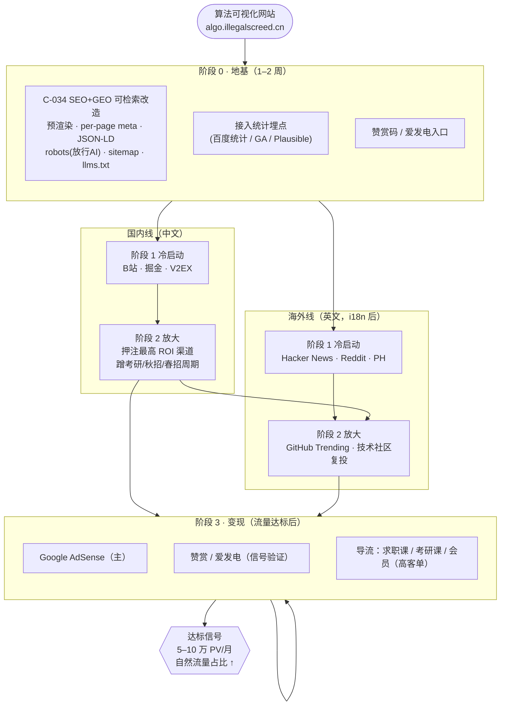
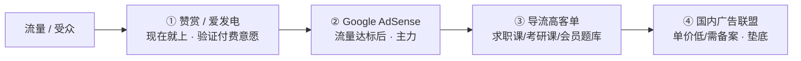

# 营销与增长路线图（双线并行 · 流量 → 变现）

> Status: active
> Owner: IllegalCreed
> Created: 2026-06-29
> Last reviewed: 2026-06-29
> Related milestone: `docs/roadmap.md` M5（增长与可发现性）
> Related plans: C-034（SEO+GEO 可检索地基，`docs/plans/20260629-c034-seo-geo-foundation/`）

## 这份文档是什么

把「在国内技术论坛营销网站、未来靠广告变现」这个目标，落成一份**可执行的分阶段路线图**：先校准预期，再定渠道、内容、变现，最后串成一条主脉络。具体的技术改造（SEO/GEO 地基）拆到独立变更 **C-034**，本文件只管「营销战略」这一层，不写代码细节。

**一句话定位**：本站是面向中文（及英文）开发者/学生的**算法与数据结构可视化学习工具**，目标受众＝计算机学生、考研/秋招备战者、前端/后端工程师、算法爱好者。

## 一、先校准预期：三个硬现实

变现规划必须建立在事实上，不画饼。

1. **广告变现是流量的游戏，工具站流量天花板偏低。** 算法可视化是「用完即走」的学习工具，停留短、复访低。按中文内容站经验，广告 RPM（每千次展示收入）约 ¥5–15，靠广告月入 ¥1000 需 **8–20 万 PV/月**。广告是「流量到了顺手开的水龙头」，不是启动引擎。
2. **SPA 的 SEO/GEO 硬伤。** 现站是 Vue3 history 模式 SPA，爬虫（搜索引擎 + AI）抓到的是空壳，自然搜索/AI 推荐这条「免费长尾流量」基本为零。**这是增长的地基缺口，由 C-034 解决。**
3. **国内变现合规门槛。** GitHub Pages / 国外服务器无 ICP 备案 → 百度联盟等国内广告联盟与部分推广渠道受限。Google AdSense 不要求备案，故**广告变现主走 AdSense + 海外流量更现实**。

> 结论：国内论坛适合「涨流量、攒口碑」，广告变现主力靠 AdSense（吃中英双语流量）。**这正是选择「双线并行」的根本原因。**

## 二、总策略：双线并行

| 线         | 主战场                                       | 语言 | 喂养的引擎                                     | 角色                          |
| ---------- | -------------------------------------------- | ---- | ---------------------------------------------- | ----------------------------- |
| **国内线** | B站 / 掘金 / V2EX / 知乎 / 小红书 / 公众号   | 中文 | 百度、豆包/Kimi/文心/DeepSeek（中文 GEO）      | 攒口碑、起量、私域沉淀        |
| **海外线** | Hacker News / Reddit / Product Hunt / GitHub | 英文 | Google、Bing、ChatGPT/Perplexity/Claude（GEO） | AdSense 高 RPM 流量、技术背书 |

两线共用同一套**增长工程地基**（C-034）：预渲染让内容对所有爬虫可见，是 SEO 与 GEO 的共同前提。双线的额外成本主要是「双语」，安排在地基验证有效后的下一阶段（i18n）补齐。

## 三、主脉络图

## 四、四阶段路线

| 阶段         | 目标                           | 周期       | 关键动作                                                                        | 出口标准（满足才进下一阶段）                                 |
| ------------ | ------------------------------ | ---------- | ------------------------------------------------------------------------------- | ------------------------------------------------------------ |
| **0 地基**   | 流量「留得住、追得到、可引用」 | 1–2 周     | C-034 上线（预渲染+meta+JSON-LD+robots+sitemap+llms.txt）；接统计埋点；放赞赏码 | 搜索引擎能抓到各算法页正文；分享有大图卡片；统计能看渠道来源 |
| **1 冷启动** | 第一批种子用户 + 验证渠道      | 1–2 月     | 国内 B站/掘金/V2EX、海外 HN/Reddit 各发「我做了个 X」；观察哪个渠道反馈最好     | 跑出 1–2 个「投入产出明显高于其他」的渠道                    |
| **2 放大**   | 复制高 ROI 渠道、上量          | 3–6 月     | 押注冷启动跑出的渠道高频产出；蹭考研/秋招/春招周期；GitHub 冲 star/Trending     | 月 PV 进入万级并稳定增长；自然搜索/AI 来源开始有占比         |
| **3 变现**   | 流量到量后开广告 + 辅助变现    | 流量达标后 | 接 AdSense；赞赏；按受众导流课程/会员                                           | 广告月收入可量化；ARPU 与渠道 ROI 可归因                     |

**核心原则：变现放最后。** PV 没到 5–10 万/月之前开满广告，挣不到钱还伤体验。

## 五、渠道矩阵与打法

国内论坛**硬广必死**，一律「分享价值、工具顺带提」。

**🥇 第一梯队（先押）**

- **B站** —— 算法可视化天生适合视频（「60 秒看懂快排」录屏+讲解），传播性最强，考研/八股受众密集。
- **掘金** —— 前端/学习氛围浓，发「我用 Vue 做了个算法可视化工具」项目分享文，易上热门带链接。
- **V2EX** —— `分享创造` 节点，程序员密集，一帖一波精准流量。

**🥈 第二梯队** —— 知乎（回答「算法怎么学/数据结构可视化」带链接）、小红书（考研/学习赛道）、思否、CSDN（走量质量杂）。

**🥉 沉淀池** —— 微信公众号（私域反复触达）、GitHub README（开源引流，冲 Trending）。

**海外线** —— Hacker News（`Show HN:`，算法可视化历史上很吃香）、Reddit（`r/programming`、`r/compsci`、`r/learnprogramming`）、Product Hunt（发布日集中曝光）。

## 六、内容策略

**软文模板（可复用）**

> 标题：《面试前我把十大排序算法做成了动画，终于不用死记硬背》
> 结构：痛点（背不住/看不懂）→ 我做了啥（放动图）→ 在线体验（链接）→ 技术实现（给同行看，涨可信度）

**蹭周期日历**（算法学习需求暴涨窗口，提前 2 周铺内容）

- **9–10 月**：秋招
- **12 月**：考研
- **3 月**：春招

## 七、变现路径（务实排序）

1. **早期**：赞赏码/爱发电——不指望赚钱，是「有人愿付费」的信号验证。
2. **中期**：Google AdSense（配合海外流量 RPM 更高）。
3. **高价值**：导流——算法学习用户是求职课/考研课/会员题库的精准受众，单用户价值远高于广告。
4. **最后**：国内广告联盟（单价低、需备案，性价比垫底）。

## 八、增长工程（技术地基 → C-034）

营销的「免费长尾流量」靠技术地基撑。详见 [C-034 四文档](../plans/20260629-c034-seo-geo-foundation/)。要点：

- **SEO 与 GEO 同源**：预渲染让每个算法页对搜索引擎爬虫与 AI 爬虫都可见，是两者共同前提（80% 共用地基）。
- **GEO 增量**：robots.txt 显式放行 AI 爬虫（GPTBot/ClaudeBot/PerplexityBot/Google-Extended/Bytespider 等）；JSON-LD 结构化数据（`SoftwareApplication`/`LearningResource`/`FAQPage`/`BreadcrumbList`）；`llms.txt` 站点说明书；Bing Webmaster 提交（Perplexity/Copilot 走 Bing）。
- **外部高权重引用喂养 GEO**：GitHub star、知乎/掘金高赞、HN 上榜——与本路线图的双线营销完全重合，营销动作本身在反哺 AI 推荐。
- **内容结构化（后续 E2）**：每个算法页补「是什么/时间复杂度/适用场景/常见面试题」问答与对比表，AI 最爱引用——作为 C-034 之后的内容迭代。

## 九、关键指标与里程碑信号

| 指标                 | 阶段 0 后      | 阶段 2 目标  | 阶段 3 门槛        |
| -------------------- | -------------- | ------------ | ------------------ |
| 月 PV                | 有埋点可量     | 万级稳定增长 | 5–10 万+           |
| 自然搜索/AI 来源占比 | 开始有         | 稳定上升     | 成为主要来源之一   |
| 收录页数（搜索引擎） | 各算法页被收录 | 全站收录     | —                  |
| 变现                 | 赞赏入口上线   | —            | AdSense 可量化收入 |

## 十、风险与红线

- **硬广风险**：国内论坛硬广被封号——坚持内容营销。
- **流量错配**：靠人肉发帖的流量发完就归零——务必先做好 C-034 的自然流量地基。
- **变现过早**：流量不足时开满广告，伤体验、收益低——严守「变现放最后」。
- **合规**：国内广告联盟/备案问题——主走 AdSense 规避。

## 十一、关联与入口

| 文档                                           | 用途                                   |
| ---------------------------------------------- | -------------------------------------- |
| `docs/roadmap.md`                              | 项目总路线图（M0–M5，本路线图对应 M5） |
| `docs/plans/20260629-c034-seo-geo-foundation/` | SEO+GEO 技术地基的需求/设计/实现/测试  |
| `docs/plans/index.md`                          | 全部变更计划索引                       |

## 十二、变更历史

- 2026-06-29：创建。与 Owner 敲定「双线并行」（国内 B站/掘金/V2EX 攒口碑 + 海外 HN/Reddit 接 AdSense），i18n 双语放地基验证后的下一阶段（推荐 B 方案）。GEO 纳入、与 SEO 同源，归入技术地基 C-034。校准三个硬现实（广告流量门槛、SPA 可检索硬伤、国内备案）。本路线图对应新里程碑 M5「增长与可发现性」。
