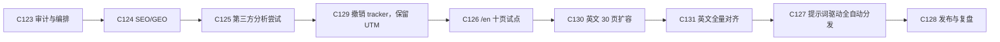

# 营销与增长路线图

> Status: active
> Owner: IllegalCreed
> Created: 2026-06-29
> Last reviewed: 2026-07-11
> Current execution source: `docs/marketing/execution-backlog.md`
> Related plans: C-20260710-123、C-20260710-124、C-20260710-129、C-20260711-126、C-20260711-127、C-20260711-130、C-20260711-131；C-20260629-034 与 C-20260710-125 已 superseded

## 定位

本文件保存增长策略、受众、渠道和指标原则。当前状态、执行顺序、依赖与退出条件以 [`execution-backlog.md`](./execution-backlog.md) 为准；首发文案与素材清单见 [`launch-posts.md`](./launch-posts.md)。

**产品定位**：面向计算机学生、求职/考试准备者和开发者的交互式算法与数据结构学习工具。中文与英文均具备 95 个完整索引页；当前不扩第三语言。

## 当前判断

1. 项目已经有 92 个条目、互动播放器、搜索、学习路径、复杂度速查、全局分享卡和首发文案，内容与产品基础足够进入增长验证。
2. 当前站点仍是客户端 Vue SPA，但 C131 已用 Playwright 在构建后输出 190 个带真实正文的静态入口，并通过双 base 门禁、Pages/selfhost 与线上 HTTP 抽查；客户端继续接管交互。
3. route head、尾斜杠 canonical、JSON-LD、按 catalog 生成的 sitemap/llms、95 组双向 hreflang 与 crawler 策略已落地；第三方分析已撤销。C131 的英文全量目录已 verified；C127 T1/T2 已完成并达到 55%，当前进入 adapter contract 阶段。
4. robots、结构化数据、`llms.txt` 或预渲染都不能保证排名、收录、富结果或 AI 引用。冷启动先用 UTM、渠道原生指标、实际发布 URL 与人工反馈复盘，稳定流量出现后再评审统计投入。
5. 站点适合内容驱动获客。广告与重度变现应晚于稳定流量和体验验证，不作为冷启动的启动器。

## 双线策略

| 路线     | 主要受众                 | 首批渠道                                                                 | 前置条件                              | 目标                                     |
| -------- | ------------------------ | ------------------------------------------------------------------------ | ------------------------------------- | ---------------------------------------- |
| 国内中文 | 学生、求职者、中文开发者 | 自动优先微博与 GitHub；V2EX/掘金保留人工；B站/公众号因无企业主体禁用     | C127 adapter + 免费个人账号授权       | 获取种子用户、收集产品反馈、比较渠道效率 |
| 海外英文 | 英文学习者与开发者       | 自动优先 Bluesky、DEV、Mastodon、GitHub；Reddit 条件接入；HN/PH 人工发布 | C126/C130 + C127；逐渠道完成授权/审核 | 验证英文需求、自然搜索与海外渠道         |

两条路线共用 canonical 内容、UTM 规则、素材清单和复盘模板，但不直接复用同一文案。渠道等级和官方依据见 [`channel-automation-audit.md`](./channel-automation-audit.md)；能力变化时先复审注册表，再改变自动化状态。

## 执行主线

| 阶段 | 策略目的                                                  | 当前状态    |
| ---- | --------------------------------------------------------- | ----------- |
| C123 | 把历史草案、现有资产和缺口整理成唯一执行清单              | verified    |
| C124 | 建立每页可验证的搜索与机器可读语义                        | verified    |
| C125 | 建立来源、行为和 campaign 归因                            | superseded  |
| C129 | 撤销第三方 tracker，仅保留零成本 UTM 工具                 | verified    |
| C126 | 用十页 `/en` 样本验证国际化质量和需求                     | verified    |
| C130 | 收束 locale catalog，并将英文扩到 30 页                   | verified    |
| C131 | 将 95 个中文索引页全部对齐英文                            | verified    |
| C127 | T1/T2 已完成；下一步接 API adapter，凭据继续与 Codex 隔离 | in-progress |
| C128 | 分批发布，在 48 小时和 7 天复盘后决定投入                 | planned     |

## 内容策略

### 核心叙事

- 学习价值：逐步动画把边界、指针、状态转移和数据结构变化显示出来。
- 可操作性：可改单次输入、拖动步骤、切换四种代码语言、做关键步测验。
- 内容广度：中文与英文均覆盖九大类 92 个学习条目，另有复杂度速查与八条学习路径。
- 工程可信度：Vue 3 + TypeScript 的可插拔轨架构，Vitest、Playwright 和覆盖率门禁已经落地。

### 内容单元

每个 campaign 从一个可验证主题出发，至少包含：目标受众、一个痛点、一个代表页面、一段真实操作素材、一个带 UTM 渠道标签的链接和一个明确反馈问题。优先复用：

- 快速排序自定义输入与 partition 过程。
- 二分查找测验模式。
- Pollard's Rho 的龟兔与因子揭示。
- 图算法、动态规划和字符串算法的状态轨对比。
- “如何选择学习顺序”和“复杂度快速对照”类导航内容。

### 发布原则

- 先提供信息和可验证的演示，链接作为自然延伸，避免硬广式堆砌。
- 同一主题按平台重写标题、长度、媒体和互动问题。
- Owner 提示词是单次 campaign 授权；已完成一次性接入的 A 级渠道不再逐帖审批。
- 自动化在发布前执行事实、截图、链接、平台规则、重复度和语言校验；高风险主题与无法判定项升级 Owner。
- 只有能力注册表、当前授权和成本 guard 同时通过时才调用官方能力，不绕过平台风控或补用网页模拟。

## 渠道实验

| 渠道             | 自动化状态                 | 首个内容形态            | 主要观察                            |
| ---------------- | -------------------------- | ----------------------- | ----------------------------------- |
| GitHub           | A：首批自动                | Release + 反馈 Issue    | Release 访问、Issue/评论、14 天流量 |
| 微博             | A：首批自动                | 中文短帖/长文 + 动图    | 阅读、互动、评论中的学习需求        |
| Bluesky          | A：首批自动                | 英文串文 + 链接卡       | 互动、回复质量、转发                |
| DEV              | A：自动发布/监测，人工回复 | 英文技术长文            | 阅读、反应、评论、canonical 同步    |
| Mastodon         | A：首批自动                | 英文/中文短帖串         | 互动、回复质量、实例接受度          |
| B站/公众号       | B：当前主体约束禁用        | -                       | 不进入当前实验                      |
| Reddit           | B：免费个人后备            | 社区定制帖              | 审核/社区授权通过后再实验           |
| V2EX/HN/PH       | C：人工发布后自动监测      | 短帖 / Show HN / 发布页 | 技术反馈、讨论质量、公开互动        |
| 掘金/知乎/小红书 | D：人工渠道                | 长文 / 笔记             | 不纳入 C127 自动化承诺              |
| X                | 付费禁用                   | -                       | 零新增费用约束下不进入实验          |

渠道优先级只是首轮假设。C128 先结合渠道原生指标、UTM 链接、实际评论与投入时间做 48 小时和 7 天复盘；在没有站内统计时明确写出可观测边界。

## 指标原则

### 地基指标

- 可索引 URL 数、抓取/渲染错误、canonical 与 hreflang 正确率。
- sitemap 发现与收录覆盖；不把“已提交”视为“已收录”。
- 代表性页面 HTML 产物与结构化数据测试结果。

### 获客指标

- 平台公开或账号后台可见的曝光、阅读、点击、互动、评论和关注；每项标注来源与观测限制。
- 实际发布 URL、post ID、素材版本、发布时间和 UTM；UTM 只标识链接，不把它误写成已观测到站内 session。
- 每个渠道的内容制作/维护时间与有效公开反馈，形成当前可得的投入产出比较。

### 学习行为代理指标

- 搜索、播放、自定义输入、测验完成、分享、语言切换属于未来测量候选，目前没有 tracker 或日志链路，C128 不声称可见。
- 若稳定流量后重新立项统计，才评估单页播放深度、跨页学习路径和回访，并设置数据最小化与成本边界。

### 复盘窗口

- 48 小时：检查链接、异常、初始来源和评论反馈，决定是否及时修订。
- 7 天：比较渠道质量、回访和学习行为，决定保留、调整或停止。
- 更长期的自然搜索、GEO 和英文需求按月观察，避免从单次发布推导长期趋势。

## 变现边界

1. 冷启动阶段保持学习体验优先，不为了少量展示提前铺满广告。
2. 赞赏/爱发电可以作为低干扰的意愿信号，但需 Owner 提供合规素材。
3. AdSense 或其他广告方案在 C128 之后单独立项，基于真实流量、地域、隐私和体验数据设门槛。
4. 国内备案、广告联盟和平台合规要求在采用前重新核实，不把 2026-06-29 的估算当当前事实。

## 风险与红线

- 在没有流量前先购买分析服务：成本早于价值验证；冷启动先用 UTM、渠道原生指标和人工反馈，稳定流量后再立项。
- 只翻导航不翻正文：形成混合语言低质量页；C131 已用 65 个新增 SFC、互动状态与播放器字幕的无 Han 门禁完成全量验证。
- 把 robots/JSON-LD/llms.txt 当增长承诺：这些只是可发现性输入，结果仍由平台与内容质量决定。
- 不区分平台能力强行全自动：可能违反规则或重复发帖；C127 必须以官方 adapter、能力 gate、幂等键、频率限制和失败关闭控制。
- 渠道凭据进入仓库或日志：一律禁止，使用受控 secrets 并记录 Owner。
- 把账号低价值当作绕过规则的理由：账号损失不解决接口稳定性、用户信任和长期维护问题；不使用主密码、Cookie、内部 API 或验证码绕过。
- 同时扩第三语言或全部渠道：英文全量已完成；后续一次只推进 C127 当前批次，避免内容和渠道双重扩面。

## 关联入口

| 文档                                           | 用途                                |
| ---------------------------------------------- | ----------------------------------- |
| `docs/marketing/execution-backlog.md`          | 当前状态、C124-C130 顺序和退出条件  |
| `docs/marketing/channel-automation-audit.md`   | 十五渠道官方能力、成本与接入边界    |
| `docs/marketing/launch-posts.md`               | 掘金、V2EX、B站首发草稿与素材清单   |
| `docs/plans/20260710-c123-growth-execution/`   | 本轮审计、设计、实现与测试证据      |
| `docs/plans/20260710-c124-seo-geo-foundation/` | 当前 SEO/GEO 实现、测试与发布证据   |
| `docs/plans/20260710-c129-analytics-rollback/` | 第三方分析撤销与 UTM 保留决策       |
| `docs/plans/20260711-c126-en-pilot/`           | `/en` 十页试点、hreflang 与验证证据 |
| `docs/plans/20260711-c127-auto-distribution/`  | C127 需求、架构、实施和测试入口     |
| `docs/plans/20260711-c130-en-30-pages/`        | 英文 30 页扩容实现与验证证据        |
| `docs/plans/20260711-c131-en-full-parity/`     | 英文全量对齐实现与验证证据          |
| `docs/plans/20260629-c034-seo-geo-foundation/` | 已 superseded 的历史 SEO/GEO 草案   |
| `docs/roadmap.md`                              | 项目总路线图与当前优先级            |

SEO/GEO 外部依据集中维护在 `execution-backlog.md`；渠道发布、监测、回复、授权和成本依据集中维护在 `channel-automation-audit.md`。

## 变更历史

- 2026-06-29：创建双线增长策略和初版 C-034 技术地基假设。
- 2026-07-10：C-123 基于当前仓库和官方资料全面复审。删除绝对化抓取/收益判断，改由 C124-C128 顺序推进；C-034 当时标记 deprecated，C124 接管后转 superseded。
- 2026-07-10：C-124 完成本地实现与门禁，采用 95 页构建后预渲染、route head/JSON-LD 和同源 sitemap/llms；进入双轨发布验证，C125 成为下一执行阶段。
- 2026-07-10：C-124 双轨发布与静态深链核验完成，状态转 verified；C125 分析与渠道归因成为当前执行阶段。
- 2026-07-10：C-129 撤销 C125 第三方分析路线，仅保留 UTM；下一执行阶段改为 C126 `/en` 十页试点。
- 2026-07-11：C-126 十页英文试点、105 页双 base 产物与双轨上线完成；下一执行阶段改为 C127，自动化边界随后在该计划重新审计。
- 2026-07-11：C-127 完成十五渠道官方能力审计，当前阶段改为提示词驱动、按能力等级失败关闭的全自动分发；首批实现渠道为 GitHub、微博、Bluesky、DEV、Mastodon。
- 2026-07-11：Owner 确认零新增费用且无企业主体；微信/B站/X 移出实施范围，Reddit 降为非阻塞后备。
- 2026-07-11：C127 批准独立 `marketing-ops` MCP/RPA 隔离设计并后置；C130 英文 30 页扩容草案成为下一候选主线。
- 2026-07-11：Owner 批准 C130；工程主线进入 10/105 catalog 迁移 TDD，最终目标 30 英文/125 总页。
- 2026-07-11：C130 完成 30 页英文目录、27 个 adapter 与 125 页本地全门禁；等待双轨发布，C127 随后成为下一实施阶段。
- 2026-07-11：C130 以 `5dca6c4` 完成 Pages/selfhost 双轨上线和 125 URL 抽查；状态转 verified，工程主线切回 C127 T1。
- 2026-07-11：C131 以 `592d27d` 完成 95 英文/190 总页、95 组 hreflang、全门禁与双轨上线；工程主线恢复 C127 T2。
- 2026-07-11：C127 T2 完成公开七工具 contract 与本地 `marketing-ops` personal plugin 安全骨架；真实 adapter、账号授权和站外发布仍未开始，下一步 T3。
