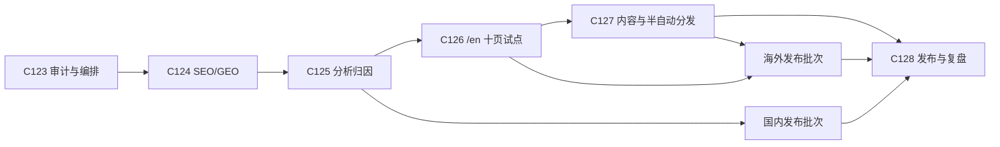

# 设计：增长执行事实源与阶段闸门

> Status: verified
> Stable ID: C-20260710-123
> Owner: IllegalCreed
> Created: 2026-07-10
> Last reviewed: 2026-07-10
> Requirements: ./requirements.md
> Implementation: ./implementation.md
> Test cases: ./test-cases.md

## 1. 文档职责

```text
docs/marketing/roadmap.md
  长期策略、受众、渠道与指标原则
              |
              v
docs/marketing/execution-backlog.md
  当前事实、C124-C128 顺序、阶段状态、退出条件、Owner 输入
              |
              +----> docs/plans/<current-change>/ 四文档
              |
              +----> docs/marketing/launch-posts.md
                       渠道文案与素材草稿
```

只有 `execution-backlog.md` 可以回答“增长下一步是什么”。路线图不重复实现细节，发布文案不承担项目状态管理，旧 plan 不自动成为当前计划。

## 2. 事实分级

| 级别       | 定义                                         | 写法                           |
| ---------- | -------------------------------------------- | ------------------------------ |
| 本地事实   | 可由当前源码、文件、构建或测试直接验证       | 写明路径、数量或缺失项         |
| 官方能力   | 来自搜索引擎、平台或规范的一手文档           | 链接原始资料，限定适用范围     |
| 项目决策   | Owner 与团队选择的顺序、阈值或边界           | 明确写成决策，不包装成行业事实 |
| 待验证假设 | 渠道效果、预渲染收益、翻译范围、自动发布能力 | 进入对应阶段实验，不提前下结论 |

## 3. 状态设计

增长执行看板使用 `verified`、`next`、`planned` 三种队列状态；真正进入开发后，以对应 plan 的标准状态机为准。C123 完成后只把 C124 标为 `next`，不会在 C124 四文档尚未创建时写成 `approved` 或 `in-progress`。

## 4. 阶段依赖



顺序是默认主线，不阻止低风险维护并行；任何调整必须回写执行清单并说明证据。

## 5. 关键决策

### D1 C-034 只做历史降级

C-034 从未进入 approved/in-progress，且部分资产后来由 C-117/C-118 以不同边界落地。现在将其标记为 `deprecated`，保留当时的技术思路与原因。C124 创建后若完整接管，再将 C-034 改为 `superseded` 并建立双向链接。

### D2 C124 重新验证渲染方案

当前不把 Playwright 预渲染当成结论。C124 先比较构建体积、双 base、history fallback、正文产物和维护成本，再选择预渲染、SSG 或其他方案。无论选择什么，必须以产物测试而不是 Lighthouse 单次分数作为门禁。

### D3 搜索抓取与模型训练分离

robots 当前通用放行不等于已形成策略。C124 要分别记录 OAI-SearchBot 等搜索抓取选择与 GPTBot 等训练抓取选择，Owner 对训练策略保留最终决定。

### D4 中文根路径与英文 `/en`

现有中文 URL 和外部链接保持稳定，英文试点放在 `/en`。只有十页内容、切换、搜索和国际 SEO 全链路验证后，才讨论扩面。

### D5 自动化从生成开始

C127 的第一可交付物是可重复、可审阅的渠道草稿，不是无人值守发帖。发布动作需要人工批准、官方 API、密钥隔离、失败恢复和审计记录。

## 6. 更新范围

| 文件                                            | 动作                                 |
| ----------------------------------------------- | ------------------------------------ |
| `docs/marketing/execution-backlog.md`           | 新增当前执行事实源                   |
| `docs/marketing/roadmap.md`                     | 校正旧假设并链接 C123/C124-C128      |
| `docs/plans/20260710-c123-growth-execution/*`   | 新增四文档                           |
| `docs/plans/20260629-c034-seo-geo-foundation/*` | 只更新状态、复审日期、关联和历史说明 |
| `docs/plans/index.md`                           | 同步 C034 与 C123 三张表             |
| `docs/roadmap.md`、`docs/overview.md`           | 将当前阶段指向增长执行清单           |
| `AGENTS.md`、`CLAUDE.md`                        | 增加持久记忆入口和当前阶段事实       |
| `docs/plans/completion-backlog.md`              | 保留 1.0 完结历史并指向后续清单      |
| `docs/test-cases/{index,by-layer,by-module}.md` | 登记六个文档验收 Case                |

## 7. 风险控制

- 文档漂移：由三个索引 Case 和 agent 入口 Case 守护。
- 旧计划误执行：C034 四文档顶部同时标记 `deprecated`，不只改总索引。
- 外部资料失效：只引用官方或提案原站，记录日期和适用边界；实施时再复核。
- 过度自动化：C127 明确 dry-run、审批和官方 API 红线。
- 扩面过早：C126 十页样本有停止条件，不以“多语言已开工”推导全站翻译。

## 变更历史

- 2026-07-10：创建。确立策略、执行、素材、plan 四层职责及 C124-C128 阶段闸门。
- 2026-07-10：文档职责、历史降级和阶段依赖经索引检查验证，状态转 verified。
