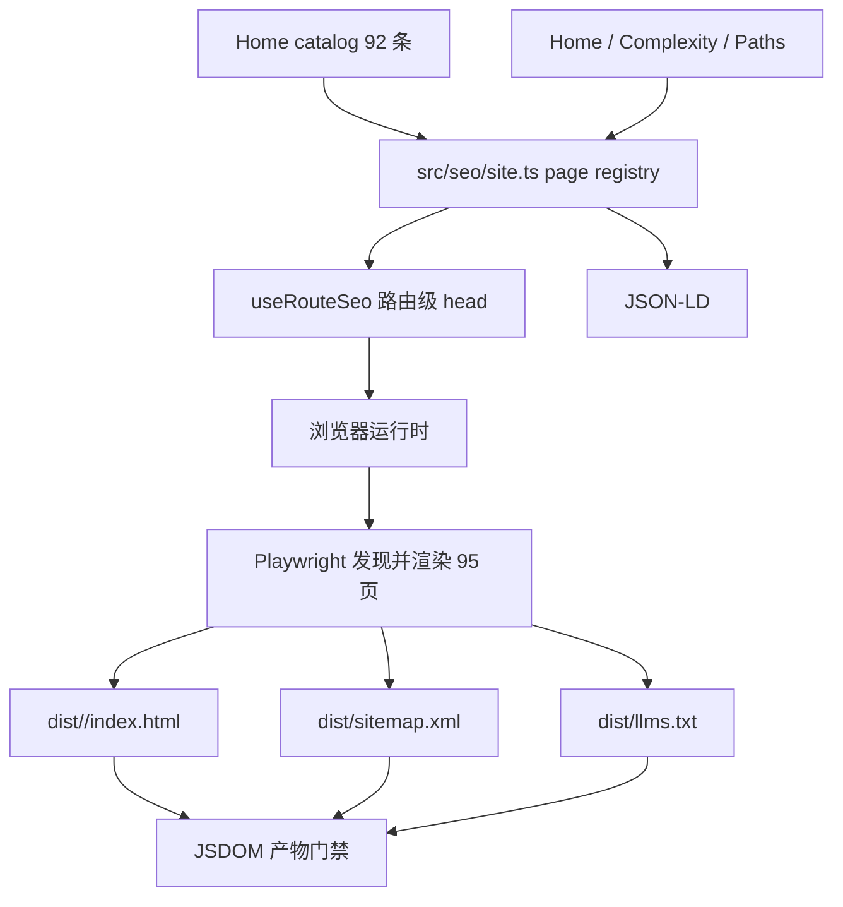

# 设计：路由级 head 与构建后预渲染

> Status: verified
> Stable ID: C-20260710-124
> Owner: IllegalCreed
> Created: 2026-07-10
> Last reviewed: 2026-07-10
> Requirements: ./requirements.md
> Implementation: ./implementation.md
> Test cases: ./test-cases.md

## 1. 总体结构



页面元数据只从现有 Home catalog 和三个功能页定义产生。Router 仍负责组件映射，但 L3 测试要求 registry 与 router 可索引路由集合完全一致。

## 2. 页面模型

```ts
interface SeoPage {
  name: string;
  path: string;
  title: string;
  heading: string;
  description: string;
  category?: string;
  canonical: string;
  indexable: boolean;
  robots: 'index,follow,max-image-preview:large' | 'noindex,nofollow';
}
```

- 内容页 path 固定 `/docs/${slug}`，heading/title/description/category 取自 Home catalog。
- 功能页显式定义三项，不复制文章 URL。
- canonical 的内容页统一带尾斜杠，以命中 `dist/docs/<slug>/index.html`；route path 继续保持现有无尾斜杠形态。
- 未知、`docs`、`about` 生成 noindex fallback，不进入 registry。

## 3. Head 管理

不增加依赖。`useRouteSeo()` watch `route.name + route.path`，调用 `applyPageSeo()`：

- 更新 `document.documentElement.lang` 与 `data-seo-ready`。
- 通过 selector upsert 单个 description/robots/OG/Twitter/canonical。
- 更新 `script#seo-json-ld`，保持单节点。
- query/hash 不参与 canonical；内容页 canonical 补尾斜杠，首页保持 `/`。

`index.html` 提供首页 fallback，禁用 JavaScript时仍有正确 root metadata；运行时以 registry 值覆盖。

## 4. JSON-LD

首页：

- `WebSite`：站名、URL、中文语言、描述。
- `SoftwareApplication`：教育 Web 应用、URL、描述、免费访问。

内容页：

- `LearningResource`：name/description/url/inLanguage/category/isPartOf。
- `BreadcrumbList`：首页 -> category（有则）-> 当前页；中间 category 不伪造不存在的 URL。

所有实体放在单个 `@context + @graph` 对象内。不生成 FAQPage、Review、AggregateRating 或页面不可见声明。

## 5. 预渲染管线

### 发现

1. `vite build` 完成后以相同 mode 启动 Vite preview。
2. Playwright 访问 base root，等待 `html[data-seo-ready="home"]` 与 h1。
3. 从 `a.item` 提取 pathname/title/description，断言正好 92 条、URL 唯一且都在 `/docs/`。
4. 加入 Home/Complexity/Paths，形成 95 页任务。

### 渲染

- 一个 Chromium browser/context，默认 4 个 worker page 并发。
- 首页等待全局 h1；内容页等待可见 `article`、`article h1` 与至少 200 字符正文，避免菜单文本误满足“非空壳”条件。
- 记录 `pageerror`、error 级 console、失败请求与 4xx/5xx 响应；任一错误使构建失败。
- 写出 HTML 前把本地 `/docs/<slug>` 链接规范成尾斜杠，使静态内链与 canonical/目录入口一致。
- `page.content()` 写到 route 对应目录。根页覆盖 `dist/index.html`，其他页写 `dist/docs/<slug>/index.html`。

### 生成

- sitemap 使用 95 个 canonical，统一主站 origin。
- llms.txt 使用页面 heading/description/canonical，完整列出所有页面。
- 输出临时 manifest `dist/seo-manifest.json` 给 artifact verifier；验证后保留，便于发布诊断。

## 6. 产物门禁

`scripts/verify-seo.mjs` 使用 JSDOM/XML DOM，不做字符串猜测：

- manifest 恰好 95 条且 path/title/canonical 唯一。
- sitemap `<loc>` 集合与 manifest canonical 集合相等。
- 每个 HTML 的 `#app.textContent` 达最低正文长度；h1 存在。
- lang、title、description、canonical、robots、OG URL、JSON-LD 均与 manifest 一致。
- title 全局唯一；llms.txt 包含每个 canonical。
- production mode 的脚本/样式 URL 使用 `/algorithms-visualization/`，selfhost mode 使用 `/` 且不混入 Pages base。
- 内容页必须有 `article h1` 与至少 200 字符文章正文；静态站内内容链接必须带尾斜杠。
- 写出后通过本地 preview 逐一请求 95 个 canonical 形态 URL，响应 title/canonical 必须命中对应页面而不是首页 fallback。

## 7. 构建与部署

| 入口                  | 构建                                     | 预渲染 mode | 验证                   |
| --------------------- | ---------------------------------------- | ----------- | ---------------------- |
| `pnpm build-only`     | `vite build`                             | production  | production base        |
| `pnpm build:selfhost` | `vite build --mode selfhost`             | selfhost    | root base              |
| Pages CI              | 完整门禁后安装 Chromium，再 `build-only` | production  | artifact gate + Deploy |
| `scripts/deploy.sh`   | type-check 后 `build:selfhost`           | selfhost    | 上传前本地 gate        |

CI 安装 Chromium 只放在 Build 前，单元测试不依赖浏览器。自有域部署沿用原子目录切换。

## 8. 兼容性与风险

- Vue 使用 `createApp` 而非 hydration：加载预渲染页后清空并重建 `#app`，现有交互语义不变；接受一次轻量重建，不在本期引入 SSR hydration。
- 95 页会增加构建时间与 dist 体积；使用 4 worker 并发并记录总耗时。若 CI 超时，先调并发/等待条件，不牺牲产物验证。
- Shiki 与懒加载 chunk 可能延迟 network idle；每页有独立超时和路由上下文错误信息。
- Pages/selfhost base 是最高风险点，必须各构建一次并由 verifier 检查资源 URL。
- robots 训练策略是项目决策：OAI-SearchBot 与 GPTBot 分开，后续 Owner 改策略需新 plan/测试。

## 9. 文件范围

| 文件                                    | 动作                                          |
| --------------------------------------- | --------------------------------------------- |
| `src/seo/site.ts` + spec                | 页面 registry、JSON-LD、纯函数                |
| `src/seo/useRouteSeo.ts` + spec         | DOM head upsert 与路由 watch                  |
| `src/App.vue`                           | 接入 composable                               |
| `index.html`                            | zh-CN 与 root fallback meta/canonical/JSON-LD |
| `scripts/prerender.mjs`                 | 发现、渲染、sitemap/llms/manifest 生成        |
| `scripts/verify-seo.mjs`                | JSDOM 产物门禁                                |
| `public/robots.txt`                     | 搜索/训练 crawler 策略                        |
| `public/sitemap.xml`、`public/llms.txt` | 删除静态手工版本，改由 build 生成             |
| `package.json`、workflow、deploy script | 统一双 mode 构建管线与 CI browser             |
| `e2e/seo.e2e.ts`                        | 运行时 head/SPA 导航回归                      |

## 变更历史

- 2026-07-10：创建。选择零 head 新依赖、真实 UI 路由发现、Playwright post-build 和 JSDOM 全产物门禁。
- 2026-07-10：静态入口审计发现无尾斜杠深链会命中首页 fallback；canonical、sitemap、llms 与预渲染内链统一改为尾斜杠，并加入逐 URL HTTP 命中验证。
- 2026-07-10：production/selfhost 本地与线上双 base 均验证通过，设计状态转 verified。
