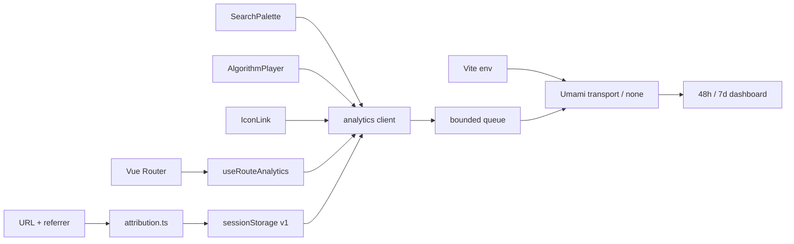

# 设计：隐私优先的分析与渠道归因层

> Status: superseded
> Stable ID: C-20260710-125
> Owner: IllegalCreed
> Created: 2026-07-10
> Last reviewed: 2026-07-10
> Requirements: ./requirements.md
> Implementation: ./implementation.md
> Test cases: ./test-cases.md
> Replaced by: C-20260710-129

> 本设计仅保留为历史评审记录。C129 已撤销第三方 tracker、会话归因和交互事件；当前只保留供应商无关的 UTM 生成能力，不得继续执行本文的 Umami 激活方案。

## 1. 供应商评审

| 方案         | 隐私与同意                                                                | 成本/托管                            | SPA 与事件                                        | 结论                     |
| ------------ | ------------------------------------------------------------------------- | ------------------------------------ | ------------------------------------------------- | ------------------------ |
| GA4          | Web tag 默认用 `_ga` 等第一方 Cookie；需管理 analytics consent 与数据控制 | 标准版免费，Google 托管              | 成熟，但配置面大，自定义维度通常 24-48 小时可报告 | 本期不选                 |
| Plausible    | 官方声明无 Cookie、无持久标识，聚合统计；云数据在 EU                      | Cloud 付费且按 pageview/event 计量   | 支持 SPA、custom events/properties，运维最少      | 低运维付费备选           |
| Umami Cloud  | 官方 FAQ 声明 tracker 无 Cookie；Cloud 可选 US/EU 区域并支持数据导出      | Hobby 免费、官方托管；账号需邮箱验证 | 与自托管版同一 tracker，支持手动 pageview/event   | 本期生产候选             |
| Umami 自托管 | 同一无 Cookie tracker，数据完全自管                                       | 需 PostgreSQL、内存、备份与升级      | 能力完整                                          | 当前服务器资源不足，否决 |

官方依据：

- [GA4 Cookie usage](https://support.google.com/analytics/answer/11397207)
- [GA4 data collection](https://support.google.com/analytics/answer/11593727)
- [GA4 consent types](https://support.google.com/analytics/answer/12334711)
- [Plausible data policy](https://plausible.io/data-policy)
- [Plausible custom event properties](https://plausible.io/docs/custom-props/for-custom-events)
- [Plausible subscription plans](https://plausible.io/docs/subscription-plans)
- [Umami collect data](https://docs.umami.is/docs/collect-data)
- [Umami tracker functions](https://docs.umami.is/docs/tracker-functions)
- [Umami FAQ](https://docs.umami.is/docs/faq)
- [Umami Cloud overview](https://docs.umami.is/docs/cloud)
- [Umami Cloud FAQ](https://docs.umami.is/docs/cloud/faq)
- [Umami Cloud sign up](https://docs.umami.is/docs/cloud/sign-up)

选择 Umami 不是把供应商写死在组件内。业务代码只认识事件契约；若未来改用 Plausible，仅替换 transport 和配置，不重写交互组件。

## 2. 总体结构



## 3. 模块边界

| 文件                                        | 责任                                                         |
| ------------------------------------------- | ------------------------------------------------------------ |
| `src/analytics/types.ts`                    | 七类事件 payload、归因与 provider config 类型                |
| `src/analytics/utm.ts`                      | UTM token 规范化、campaign URL 构建                          |
| `src/analytics/attribution.ts`              | 从 URL/referrer 捕获首触/当前触，安全读写 sessionStorage     |
| `src/analytics/client.ts`                   | 配置校验、脚本加载、50 条队列、payload 清洗、Umami transport |
| `src/analytics/useRouteAnalytics.ts`        | 初始化客户端并监听 route path/name，发送手动 page view       |
| `src/components/SearchPalette.vue`          | 只在选择或无结果提交时发送无原文的搜索事件                   |
| `src/components/player/AlgorithmPlayer.vue` | 统一发送 play/input_apply/quiz_complete                      |
| `src/views/Master/Header/IconLink/*`        | 只为微博/X 增加 share channel 并在点击时发送                 |

组件不得直接访问 `window.umami`，也不得自行拼 UTM 或读写 attribution storage。

## 4. 配置与加载

```env
VITE_ANALYTICS_PROVIDER=umami
VITE_UMAMI_SCRIPT_URL=https://<analytics-host>/script.js
VITE_UMAMI_WEBSITE_ID=<public-website-id>
```

- development 默认 `none`，避免本地开发污染生产数据。
- production 与 selfhost 可指向同一 website，事件 payload 增加 `deployment=pages|selfhost` 以便排查镜像流量；不按部署拆两个属性。
- 配置不完整、非 HTTPS URL、非 UUID-like website ID 或 document 不可用时返回 disabled。
- 脚本加 `defer`、`data-auto-track="false"`、`data-website-id`；由路由 composable 统一手动发送 page view。
- 初始化前事件进入 FIFO，最多 50 条；超过上限丢弃最旧事件。script `load` 后按顺序 flush，`error` 后清空并禁用。

## 5. UTM 与归因模型

### 命名

| 字段           | 规则                      | 示例                                    |
| -------------- | ------------------------- | --------------------------------------- |
| `utm_source`   | 平台/来源域，小写稳定枚举 | `juejin`、`v2ex`、`chatgpt.com`         |
| `utm_medium`   | 渠道形态                  | `community`、`social`、`ai-referral`    |
| `utm_campaign` | 一次发布主题/批次         | `launch-2026q3`、`en-pilot-2026q3`      |
| `utm_content`  | 同 campaign 的素材/位置   | `quick-sort-longform`、`header-share-x` |

四个值都通过 `normalizeCampaignToken()`；不允许空白、邮箱形态、斜杠、中文自由文本或超过 64 字符的值进入统计。

### 会话结构

```ts
interface StoredAttribution {
  version: 1;
  first: AttributionTouch;
  current: AttributionTouch;
}
```

- 首次进入有合法 UTM：first=current=campaign touch。
- 首次进入无 UTM但有外部 referrer：只保留 hostname，medium=`referral`。
- 首次进入无有效来源：first=current=`direct/none`。
- 后续带新 UTM 的落地更新 current，不改 first。
- 后续站内导航或站内 referrer 不改 current。
- storage 抛错、禁用或 JSON 损坏时使用内存值继续，不影响业务。

## 6. 事件与去重

| 事件              | 触发点                        | 去重/限流                                  |
| ----------------- | ----------------------------- | ------------------------------------------ |
| `page_view`       | route path/name 首次及变化    | 忽略 query/hash；相同 `name + path` 不重复 |
| `search`          | 结果选择或无结果 Enter        | 每次明确提交一次，不在每次 keypress 发送   |
| `play`            | 主播放按钮或空格从暂停转播放  | 暂停、step、seek 不发送                    |
| `input_apply`     | InputBar 合法值已重建 steps   | 失败/恢复不发送；仅 item count             |
| `quiz_complete`   | quizRecord 首次达到 quizTotal | 组件生命周期内布尔 guard；重建输入后重置   |
| `share`           | 微博/X intent 链接 click      | 每次明确点击一次；普通外链无事件           |
| `language_switch` | C126 站点语言切换成功后       | 本期仅类型与 transport 契约                |

运行时 payload 清洗只接受预定义 key、有限长度字符串、有限数字和布尔值。路径先去 query/hash；用户自由文本根本不传给客户端。

## 7. Umami 映射

- `page_view`：使用 callback payload，保留 tracker 默认浏览器维度，并覆盖净化后的 url/title/referrer。
- 其他事件：同样使用 callback payload，显式写入 name/data 并覆盖 url/referrer，避免 shorthand 自动携带完整当前 URL 或静态 `document.referrer`。
- 当前触映射为净化 URL 上的标准 UTM 参数；referral 只发送 `https://hostname/`。首触留在 sessionStorage，不作为 custom property 上传。
- custom event data 只含事件白名单字段与 `deployment`；渠道筛选复用 Umami 原生 UTM/session 能力，避免重复计费属性。
- 页面类型、算法 slug、channel、trigger 等值保持低基数；不把完整 title、caption 或任意 query 作为 custom property。

## 8. 看板定义

### 48 小时

- page views / visitors（按 Umami 可用口径明确标注）。
- top source、campaign、landing page。
- `search`、`play`、`input_apply`、`quiz_complete`、`share` 事件数。
- 有效互动代理 = 至少一类 play/input_apply/quiz_complete/share；若 provider 无法直接去重用户，则只报告事件会话代理，不伪称用户转化率。
- tracker 错误、异常流量、自有域与 Pages 镜像占比。

### 7 天

- 上述指标趋势与渠道/内容页分组。
- repeat visit 仅在 provider 能以隐私友好口径提供时使用；否则标为不可得。
- 每个 campaign 给出继续、调整或停止，并附样本量与限制。

## 9. 托管决策与账号边界

- 2026-07-10 只读审计：自有服务器 2 vCPU / 1.8 GiB RAM，available 约 591 MiB、无 swap、磁盘余 18 GiB；无 Docker/PostgreSQL，已有多组 Node/PM2 服务和 nginx 站点。
- `stats` / `analytics` / `umami` 子域均无 DNS；现有证书不含这些域名。安装数据库、容器和新反代会扩大已有站点故障面，因此本期不改服务器。
- 生产候选改为 Umami Cloud Hobby。官方 FAQ 明确 Hobby 免费，Cloud 可选 US/EU、支持导出；账号注册需要邮箱验证码与区域选择。
- Owner 在 Cloud 创建 website 后只需提供公开 tracker URL 与 website ID；邮箱、密码和 API key 不进入仓库或前端。
- 优先选择 EU 区域。Hobby 档实际 retention/删除能力必须在控制台确认；目标不超过 180 天，未确认前隐私页和 plan 只能标 pending，不能写成已落实。
- 未来若服务器扩容并有独立数据库/备份预算，可在新 plan 中重新评审自托管，不复用本期否决前提。

## 10. 风险

- 广告拦截器可能阻止 tracker：看板注明可观测流量不是全部真实流量。
- Pages 与 selfhost 同属性可能出现重复访问：用 deployment 维度分辨，但 canonical 主站仍是主要分析对象。
- sessionStorage 不是 Cookie，但仍属于浏览器存储：隐私说明必须披露用途与会话生命周期。
- Cloud endpoint 在网络层可见源 IP；Umami 以 IP、User-Agent 与 website ID 派生匿名会话。隐私说明必须准确披露这一处理，不把“事件字段不含 IP”扩大成“IP 从未传输”。
- Umami Cloud 已提供 session replay、heatmap 等可选能力；website 控制台必须保持这些能力关闭，本期 tracker 也不启用 performance/identity API。
- Cloud 避免挤压现有服务器，但引入第三方托管、账号和计划限制；通过无 Cookie、字段最小化、EU 区域、导出/删除与 provider-neutral client 控制风险。

## 变更历史

- 2026-07-10：创建并批准。选择 provider-neutral client + Umami transport；明确无自由文本、手动 SPA page view、bounded queue、会话归因和远端先审计后变更。
- 2026-07-10：远端审计因内存/运行服务/数据库与 DNS 条件否决同机自托管，改选 Umami Cloud Hobby；EU 区域与 retention 待账号内确认。
- 2026-07-10：Owner 决定在项目尚未验证收入/流量前不承担第三方分析成本；C129 撤销运行时接入，本设计转 superseded。
