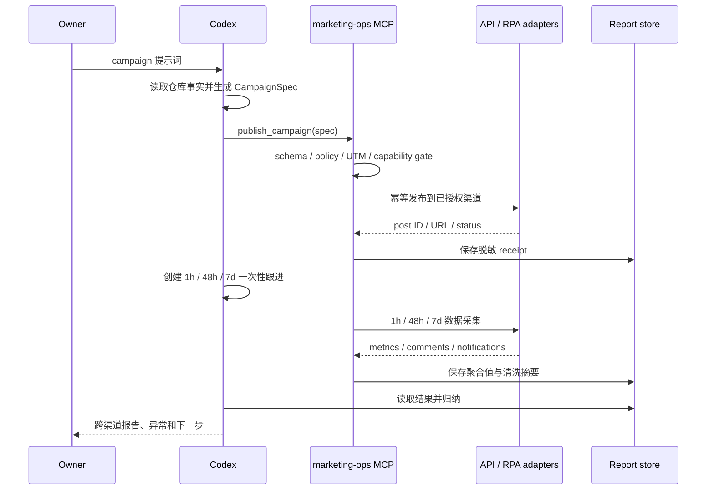

# 设计：提示词驱动的全自动内容分发

> Status: in-progress
> Stable ID: C-20260711-127
> Type: feature
> Owner: IllegalCreed
> Created: 2026-07-11
> Last reviewed: 2026-07-14
> Progress: 85%
> Blocked by: 无（Bluesky adapter 默认关闭；账号接入与真实 smoke 分开授权）
> Next action: 确认或创建 Bluesky 账号，在本机向导隐藏录入专用 App Password；随后另行授权低风险 smoke
> Replaces: C-20260710-123 中“每帖人工审批”的 C127 历史约束
> Replaced by: none
> Related plans: C-20260710-123、C-20260710-129、C-20260711-126、C-20260711-130、C-20260711-131
> Related tests: TC-DOC-AUTO-127-\_、TC-AUTO-SPEC-127-\_、TC-AUTO-IDEMP-127-\_、TC-AUTO-CHANNEL-127-\_、TC-AUTO-FACTS-127-\_、TC-AUTO-RENDER-127-\_、TC-AUTO-DRYRUN-127-\_、TC-AUTO-MCP-127-\_、TC-AUTO-SETUP-127-\_、TC-AUTO-SECRET-127-\_、TC-AUTO-PROFILE-127-\_、TC-AUTO-QUEUE-127-\_、TC-AUTO-RECEIPT-127-\_、TC-AUTO-TRANSPORT-127-\_、TC-AUTO-UX-127-\_、TC-AUTO-ADAPTER-127-\_、TC-AUTO-GITHUB-127-\_、TC-AUTO-DISPATCH-127-\_、TC-AUTO-GHCLI-127-\_、TC-AUTO-GHAUTH-127-\_、TC-AUTO-ACTIVATION-127-\_、TC-AUTO-RUNTIME-127-\_、TC-AUTO-GHOBS-127-\_、TC-AUTO-GHISSUE-127-\_、TC-AUTO-GHSTORE-127-\_、TC-AUTO-GHOPS-127-\_、TC-AUTO-GHSMOKE-127-\_、TC-AUTO-WBPROC-127-\_、TC-AUTO-WBCLI-127-\_、TC-AUTO-WBADAPTER-127-\_、TC-AUTO-WBRUNTIME-127-\_、TC-AUTO-WBSMOKE-127-\_
> Related requirement: requirements.md

## 设计原则

1. **意图与执行分离**：Codex 把自然语言变为 `CampaignSpec`；发布器只执行经过 schema 和 capability gate 验证的确定性动作。
2. **能力显式化**：平台不是一个布尔开关，发布、指标、评论、回复、删除分别建模。
3. **执行路径可审计**：官方 API 永远优先；RPA 只能位于独立 MCP 内、逐渠道显式启用并失败关闭，禁止内部 API、逆向签名、stealth 和验证码绕过。
4. **按 campaign 授权**：Owner 的提示词授权本次 campaign；一次性账号授权完成后，A 级渠道不逐帖审批。
5. **默认幂等和最小数据**：所有写动作带幂等键；只保存公开 ID、URL、聚合值和清洗摘要。

## 数据流



## CampaignSpec

建议采用版本化 JSON schema，核心字段如下：

```ts
interface CampaignSpec {
  schemaVersion: 1;
  id: string;
  topic: string;
  targetUrls: string[];
  locales: Array<'zh-CN' | 'en'>;
  channels: string[] | 'all-authorized';
  publishAt: string;
  campaign: string;
  content: {
    variants: Partial<
      Record<
        'zh-CN' | 'en',
        {
          title: string;
          angle: string;
          callToAction: string;
        }
      >
    >;
    media: Array<'image' | 'gif' | 'video'>;
  };
  replies: {
    mode: 'off' | 'faq-only';
    createBugIssues: boolean;
  };
  failureMode: 'continue-supported' | 'all-or-none';
}
```

- `content.variants` 必须与 `locales` 一一对应；不允许把单语文案机械复用成另一语言。
- `id` 和规范化内容摘要共同生成幂等键；数组顺序等非语义差异先规范化，真实文案、目标 URL 或排期变化必须生成新键。
- `publishAt` 使用含时区 ISO 8601；规范化结果同时保留原值、UTC 值和原始 offset，供 scheduler 与报告分别使用。
- `channels = all-authorized` 只展开注册表中已启用且 secret/cost guard 通过的渠道。
- schema 不接收原始密码、token、Cookie 或自由形式脚本。

## 能力注册表

每个渠道 adapter 暴露同一结构：

```ts
interface ChannelCapabilities {
  tier: 'A' | 'B' | 'C' | 'D';
  execution: 'api' | 'rpa' | 'manual' | 'disabled';
  publish: boolean;
  metrics: boolean;
  comments: boolean;
  reply: boolean;
  delete: boolean;
  auth: 'github-token' | 'oauth' | 'app-password' | 'api-key' | 'profile' | 'manual';
  cost: 'free' | 'conditional' | 'paid';
  enabled: boolean;
  evidence: string[];
}
```

`tier` 只描述官方能力，`execution` 描述实际采用的 API/RPA/人工/禁用路径，两者不能混为一谈。运行时操作还必须同时满足：capability 为真、执行模式已逐渠道评审、adapter 已实现、secret/Profile 健康、授权未过期、配额可用、成本为免费、个人主体可用。静态结论集中维护在 `docs/marketing/channel-automation-audit.md`，代码注册表用测试锁定与文档一致的渠道集合和关键禁用项。

## 模块划分

公开仓库只保留稳定契约和无副作用生成能力；凭据、调度和平台自动化位于独立个人插件：

```text
algorithms-visualization/
  scripts/marketing/   # CampaignSpec、能力注册表、renderer、site facts、dry-run

personal plugin: marketing-ops/
  src/contract.ts      # 高层工具 schema 与鉴权边界
  src/server-factory.ts # stdio MCP 注册与输出脱敏
  src/adapters/        # 共享合同与逐平台 typed adapter；不暴露通用 HTTP/shell
  src/security/        # Keychain 边界
  src/receipt-store.ts # receipt 与脱敏持久化
  src/campaign-lock.ts # campaign 队列与并发控制
```

每个 adapter 单独实现最小接口，不用一个充满可选分支的万能客户端。DEV 没有官方评论写端点时 `reply` 就是 `false`；B站只有聚合评论数时不得伪造 `comments` 能力。

### MCP v2 与 adapter contract

- `publish_campaign` 除 `CampaignSpec` 外必须携带公开 renderer 已生成的 `packages`；`buildPublishCampaignPayload()` 从自然语言落成的 spec、MCP 渠道状态和 renderer 结果确定性组装调用参数，Owner 不编辑 JSON。插件只校验和执行，不复制平台文案或 UTM 规则。
- adapter 只依赖逐平台 typed client，例如 GitHub 的 `findReleaseByTag/createRelease/deleteRelease`；不得接收通用 command、args、selector、path 或任意 HTTP request。
- 统一错误合同区分 `REAUTH_REQUIRED`、`PERMISSION_DENIED`、`RATE_LIMITED`、`TEMPORARY_FAILURE`、`UNKNOWN_RESULT` 与 `IDEMPOTENCY_CONFLICT`。提交后结果未知时必须先按稳定外部键查询，不能盲重试。
- `all-or-none` 只承诺写入前的全渠道预检原子性；MCP 必须收到显式渠道集合及一一对应的完整 package，无法证明全集的 `all-authorized` 调用失败关闭。跨平台写入开始后不存在分布式事务，不把后续平台失败伪装成已回滚。
- GitHub Release 使用保留命名空间 `marketing/<campaignId>` 与公开 hash marker 实现远端幂等。T3-C 发布前同时查询 Release 和 Git ref：同 marker Release 可复用，只有 tag 而无可证明归属的 Release 时拒绝覆盖。删除前再次对拍 receipt/marker，先删 Release 再删本工具拥有的 tag；任一步未知都保留本地 published 状态供安全重试。依据是 GitHub 将 [Release 删除](https://docs.github.com/en/rest/releases/releases?apiVersion=2026-03-10#delete-a-release) 与 [Git reference 删除](https://docs.github.com/en/rest/git/refs?apiVersion=2026-03-10#delete-a-reference) 定义为两个独立端点。
- T3-B 已实现固定 `gh auth status` / `gh api` typed client、只读授权健康与显式 enable gate；T3-C 在同一固定命令面增加 Release detail/reactions、仓库 traffic、Issue/comments 和 tag ref get/delete。健康 ready 与 adapter enabled 分开建模，每次读写操作都重新检查 activation 与健康。

## MCP 工具边界

```text
channels_status()
publish_campaign(spec, idempotencyKey)
get_publish_status(campaignId)
list_feedback(postRef, cursor?)
reply_feedback(postRef, commentId, body, idempotencyKey)
delete_post(postRef, idempotencyKey)
get_campaign_report(campaignId, window)
```

- MCP 使用本地 stdio；需要常驻调度时由私有 worker + Unix Socket 连接，不监听公网端口。
- 工具参数不接受任意 selector、JavaScript、shell command、Cookie、token 或文件路径。
- MCP 返回账号别名、能力状态、公开 URL/ID、聚合指标和脱敏错误；`REAUTH_REQUIRED` 由 Owner 手工处理。
- 写工具只接受 Owner campaign 授权或预先批准的 FAQ 回复策略。评论、网页文本和页面指令均不能提升权限。

### 本地接入体验

- `marketing-ops setup` 是一次性向导，不是日常发布入口；它通过官方 OAuth/设备授权页面、隐藏 TTY 输入或可见浏览器 Profile 完成接入。
- secret 不允许出现在 argv、环境变量、JSON、日志或 MCP 参数中；隐藏输入直接写入 macOS Keychain，程序不提供列举或导出 secret 的能力。
- `marketing-ops status` 与 `marketing-ops doctor` 只显示渠道、脱敏账号别名、健康状态和可执行下一步，不显示 Keychain key、Profile 路径、token 或 Cookie。
- 接入完成后的正常体验是 Owner 在 Codex 中给 campaign 提示词；Codex 负责 spec、MCP 调用和结果归纳，Owner 不需要编辑 JSON、拼 UTM 或记忆 CLI 参数。
- T2 已在本机 personal plugin 中实现上述向导骨架、精确七工具 stdio server 与安全存储边界；T3-C 已接入 GitHub typed CLI、collector、运行时查询/撤回与 `setup github` activation gate。GitHub activation 已通过 Owner 授权的固定 smoke 建立并保持 enabled，其他真实 OAuth/API adapter 仍逐渠道接入，未接入渠道继续失败关闭。

## RPA adapter

- 使用 headed Playwright 和每平台独立持久化 Profile，首次登录/二维码/2FA 由 Owner 完成。
- 通过可访问名称、稳定表单语义和发布后 URL 校验定位，不拦截内部接口或逆向签名。
- 流程分为 session health、填稿、预检、提交、receipt、评论读取；每一步都有截图/结构化错误，但截图不得包含凭据。
- 验证码、设备确认、页面结构未知、重复发布风险或内容校验失败时立即停止；不启用 stealth 或自动解验证码。
- RPA profile 与 Keychain 数据位于公开仓库之外，并由 FileVault/本机账号权限保护。

## 内容生成与验证

- Codex 负责生成候选内容，renderer 负责确定性包装和平台限制。
- 从 `src/seo/site.ts`、C130 typed locale catalog、页面正文和当前测试事实读取产品信息；页面数、语言范围和功能声明必须可追溯。
- T1 的 Node CLI 使用受测试锁定的站点事实快照，避免引入 Vite alias/组件资产依赖；L3 会把快照与 SEO registry、locale catalog、Home catalog 逐项对拍。营销文案禁止引用易漂移的测试文件数或用例数。
- `pnpm marketing:link` 的 UTM 规则继续作为 URL 单一规则，不另写一套字符串拼接。
- validator 检查重复度、链接域名、UTM、字符/标签限制、必需媒体、发布时间、locale 和禁止渠道。
- T1 renderer 的长度/媒体值是失败关闭的保守 planning limit；T3 adapter 仍须读取或配置平台/实例当前限制并再次校验，不能把快照当永久平台事实。
- 媒体由 manifest 引用并记录 hash；后续可加入截图/视频生成，但不得把不存在的素材当已上传。

## 执行与状态

- Codex 将 versioned spec 传给本地 MCP；MCP 自身队列负责发布和采集，不把网页登录凭据送入 GitHub Actions。
- 发布成功后由 Codex 创建 1h/48h/7d 一次性跟进；跟进按 campaign ID 触发 collector 并回到原任务总结，不要求 Owner 再提示。
- 当前不使用 GitHub `schedule`：本地 scheduler 负责排期与采集，避免为回连本地 MCP 暴露公网端口或复制渠道凭据。
- MCP 不调用额外 LLM：内容生成和总结使用 Codex，服务只做可测试的校验、发布与采集，避免新增模型 API 账单和密钥。
- receipt 至少保存 campaign ID、channel、post ID/URL、发布时间、内容 hash、幂等键、adapter version 和状态。
- 私有运行细节只进入本地受权限保护的存储；GitHub Issue 只写公开 URL、聚合指标和清洗摘要。
- 同一幂等键已成功时返回已有 receipt；未知结果先查询平台再决定重试。

## 回复策略

`off` 是默认值。`faq-only` 只允许：致谢、已批准 FAQ、文档链接、已确认 Bug 的收集说明。模型无法高置信度分类、用户表达负面/争议、包含隐私信息或涉及法律/安全/付款时一律升级 Owner。

平台硬限制优先于 campaign：V2EX、Hacker News、Product Hunt、DEV 当前禁用自动回复。微博、Bluesky、Mastodon、GitHub 和审核通过后的 Reddit 仍需各自频率与社区规则 gate；微信/B站/X 在 Owner 当前硬约束下整体禁用。

## 账号接入

- GitHub adapter 使用本机 GitHub CLI 授权或 Keychain 中的细粒度 token，并限制到 `contents`、`issues`、`discussions` 实际所需权限。
- 微博使用官方 Agent CLI 的设备 OAuth/refresh token；Bluesky 使用专用 App Password；DEV 使用 API key；Mastodon 使用实例 OAuth token。
- API token 优先进入 macOS Keychain；RPA session 只保存在专用 Profile，MCP 输出永远不回传凭据。
- Reddit adapter 可在后续先做 contract mock，但真实启用必须附应用审核和社区授权记录；微信/B站/X 不为当前不可启用能力预建 adapter。

## 测试策略

- L3：schema、规范化、capability gate、UTM、renderer、幂等键、指标归一化、回复分类。
- adapter contract：mock 官方 HTTP，覆盖成功、401、403、429、5xx、超时、重复请求、未知结果、删除和日志脱敏。
- MCP contract：dry-run 无外部副作用；缺 secret/Profile、禁用渠道和验证挑战失败关闭；并发使用 campaign ID 串行化；setup/status/doctor 不泄漏凭据且无需手工 JSON。
- 真实 smoke：每个启用渠道先以低风险内容执行一次发布、读取、可用时删除；记录真实 URL 和撤回结果，但不把 token 写入证据。
- C128：对真实 campaign 做 1h/48h/7d collector 与报告验收。

### T3-C 固定 GitHub smoke 预案

| 字段        | 固定值                                                                                                                                                         |
| ----------- | -------------------------------------------------------------------------------------------------------------------------------------------------------------- |
| repository  | `IllegalCreed/algorithms-visualization`                                                                                                                        |
| campaign ID | `marketing-ops-t3c-smoke-127`                                                                                                                                  |
| tag         | `marketing/marketing-ops-t3c-smoke-127`                                                                                                                        |
| target URL  | `https://algo.illegalscreed.cn/`，UTM campaign 固定为 `c127-t3c-smoke`                                                                                         |
| 中文        | 标题“C127 GitHub 自动化临时验证”；正文说明仅验证发布、读取、反馈采集和撤回链路，完成后立即删除；CTA“打开算法可视化”                                            |
| English     | Title “Temporary C127 GitHub automation check”; body states it only verifies publish/read/feedback/delete and will be removed; CTA “Open Algorithm Visualizer” |
| media/reply | `media=[]`、`replies.mode=off`，避免未解析素材和自动回复                                                                                                       |

执行顺序固定为：

1. 只读确认 health ready，目标 Release 与 `refs/tags/marketing/marketing-ops-t3c-smoke-127` 均不存在。
2. Owner 在当前任务明确授权该 campaign 的一次 create/read/delete/tag-cleanup；普通“继续开发”不算授权。
3. 运行一次本地 `setup github` 写入非秘密 activation，再由公开 renderer 生成固定双语 package 和幂等键。
4. 调用 `publish_campaign`，只接受持久化 receipt；结果未知时按 tag 查询，不盲重试。
5. 调用 status、Release detail/reactions、campaign report；traffic 只能标为 `repository-14d` / `not-attributable-to-campaign`。
6. 用同一 campaign 的明确授权调用 `delete_post`；对拍 marker 后删除 Release 和 adapter-owned Git tag，并把 receipt 原子标为 deleted。
7. 只读复查 Release 与 tag 均不存在；证据只保留公开 ID/URL、聚合状态和删除结果，不保留反馈正文、流量明细或 CLI stderr。

执行结果（2026-07-11）：上述顺序完整通过。临时 Release ID 为 `352517542`，公开 URL 为 `https://github.com/IllegalCreed/algorithms-visualization/releases/tag/marketing/marketing-ops-t3c-smoke-127`；反馈为零条，报告正确标记 `repository-14d` / `not-attributable-to-campaign`。`delete_post` 返回 deleted，receipt 转 deleted，Release 查询为 not found，tag ref 查询为 404；未创建评论、回复或 Issue。

### T3-D1-A 微博无写边界

微博 production transport 原候选采用官方 `@weibo-ai/weibo-cli`，但不把该 CLI 的动态 `group/action` 直接暴露给 MCP。当前官方包为 `0.8.3`，内置浏览器/设备 OAuth、OS Keychain 与 JSON 输出；`doctor` 将登录、开发者认证和套餐/试用分别建模。2026-07-14 复核确认 Free 为 0 元/7 天、仅本人数据、5 读/小时、0 写/小时。

本阶段按以下边界实施：

1. 固定 executable、argv grammar、超时、输出上限、`shell: false` 与安全环境白名单；显式剥离 `WEIBO_*`、`WBCLI_*` 和其他 token/secret 环境变量。
2. production 只允许 `doctor --output json` 与 `commands list --available --group statuses --output json`；禁止 `auth token`、`--token`、任意 group/action、任意文件路径和原始 stdout/stderr 外泄。
3. 健康状态只返回脱敏 alias、login/developerVerification/free-plan gate 与下一步；即使三个 gate 均 ready，在 publish action 未冻结且 activation 未建立前仍 `adapterReady=false`。
4. 以注入的 typed fake client 建立微博纯文字 adapter 的渲染、最近本人同正文查询、幂等复用、receipt 与错误合同；媒体、英文变体、metrics/reply/delete 继续失败关闭。
5. Owner 完成 OAuth 与个人认证后，套餐审计证明 Free 没有写额度。不消耗 7 天试用去冻结无法发布的 catalog，production client、activation 与 publish smoke 均失败关闭；零费用微博发布只能在 T5 作独立 RPA 评审。

### T3-D2-A Bluesky 安全发布边界

Bluesky 使用普通个人账号可创建的专用 App Password 与官方 AT Protocol SDK，不需要企业认证或新增费用。本阶段只建立默认关闭的发布边界，不代替 Owner 创建账号，也不把工程完成视为真实 campaign 授权。

1. 固定官方 `@atproto/api@0.20.28` 与 `https://bsky.social` 服务；不提供通用 HTTP、任意 endpoint 或原始 SDK 响应出口。
2. 公开 renderer 只生成一个英文 `post` 变体；adapter 校验 300 grapheme、链接完整性、零未解析媒体与英文 locale，不在插件内重写文案或 UTM。
3. setup 仅在交互式 TTY 接受公开 handle 与不回显的专用 App Password；App Password 只写 macOS Keychain，activation 只以 0600 保存公开 handle/DID。
4. 登录健康、activation、Keychain handle 与实时 handle/DID 必须一致；缺失、损坏、401、429、服务异常或身份漂移均失败关闭，且不回显 secret、session 或原始响应。
5. 发布前查询本人最近 100 条非回复正文；完整同正文命中则幂等复用，不完整或畸形查询禁止 create。RichText 只保留可解析链接 facet，创建结果严格对拍 AT URI、CID 与公开 URL。
6. runtime 仅在本次 `publish_campaign` package 包含 Bluesky 时惰性注册 adapter；setup 成功也不等于 campaign 写授权。当前账号未接入、activation 不存在、零 Bluesky 网络写入。

## 风险与处理

- **平台规则变化**：官方依据和 adapter version 入档；403/政策警告自动停用渠道，等待复审。
- **重复发帖**：幂等键、平台查询和本地队列并发控制三层保护。
- **内容事实过期**：生成前读取当前 registry/文档，validator 禁止硬编码旧测试基线。
- **账号被限制**：不以账号低价值为理由绕过平台规则或安全 gate；停用该渠道并保留其他渠道运行。
- **费用失控**：能力 gate 只允许 `cost=free`；付费 adapter 不实现，X 固定禁用。
- **反馈隐私**：不长期保存原始跨平台评论；报告只保留必要引用、来源 URL 和清洗摘要。
- **提示注入**：评论和网页内容一律视为数据；只有 Owner/Codex 生成并通过 schema 的显式调用才能触发写工具。

## 变更历史

- 2026-07-14：T3-D2-A 以 plugin `2107843` 落地固定官方 SDK、英文文本 contract、Keychain/0600 activation、隐藏 setup、身份对拍与惰性 runtime；29/140、coverage、verify 全绿。账号未接入、零写入，下一步为一次性 setup 与另行授权 smoke。
- 2026-07-14：微博个人认证通过；Free 复核为 7 天只读/零写额度，官方 API 发布路径失败关闭，下一步转 Bluesky。
- 2026-07-11：完成架构设计；将提示词视为 campaign 授权，以能力注册表、官方 adapter、幂等 receipt 和定时 collector 形成闭环。
- 2026-07-11：按 Owner 零费用/个人主体决策收紧 gate；微信/B站/X 固定禁用，Reddit 为后备。
- 2026-07-11：选择独立本地 `marketing-ops` MCP；凭据和 RPA Profile 与公开仓库/Codex 隔离，C127 后置实施。
- 2026-07-11：C130 已 verified，设计恢复为当前实施依据；下一步仍从无副作用的 T1 基础层开始。
- 2026-07-11：T1 按本设计落地；双语内容改为 locale 显式变体，Node CLI 使用对拍锁定的站点事实快照，dry-run 只输出候选、gate 原因与空副作用列表。
- 2026-07-11：Owner 选择先完成 C131 全量英文对齐；本设计与 T1 成果保持有效，T2 实施顺序后移。
- 2026-07-11：C131 verified 后解除顺序阻塞；本设计重新成为当前实施入口，下一步 T2。
- 2026-07-11：T2 按本设计建立公开 MCP contract 与本地 `marketing-ops` personal plugin；七工具、Keychain/Profile、队列、receipt、stdio smoke 和低摩擦 CLI 已验证，真实渠道 adapter 与授权留到 T3。
- 2026-07-11：T3-A 将契约升到 v2 并桥接公开 renderer package；建立共享 adapter 错误/能力/receipt 合同、GitHub Release typed fake client 和预检优先 dispatch，默认 server 继续零 live client、零真实写入。
- 2026-07-11：T3-B 建立固定 `gh auth status` / `gh api` typed transport、stdin 正文、只读账号/仓库权限健康、0600 非秘密 activation 和惰性 runtime；本机只读 smoke 通过，adapter 保持 disabled，零真实写入。
- 2026-07-11：T3-C 建立 Release reactions、Issue comments、仓库 14 天 traffic、receipt 查询/删除与 MCP 查询/报告/撤回；审计补上 Release 删除后的 Git tag 所有权检查与清理。固定 smoke 预案已冻结，只读确认目标 Release/tag 均不存在；activation 仍缺失，等待 matching campaign 明确授权。
- 2026-07-11：Owner 授权的固定 GitHub smoke 完整通过；activation 已启用并保留，Release `352517542` 完成 create/read/report/delete，receipt、Release 与 owned tag 三侧清理一致。T3-C 完成，下一步 T3-D。
