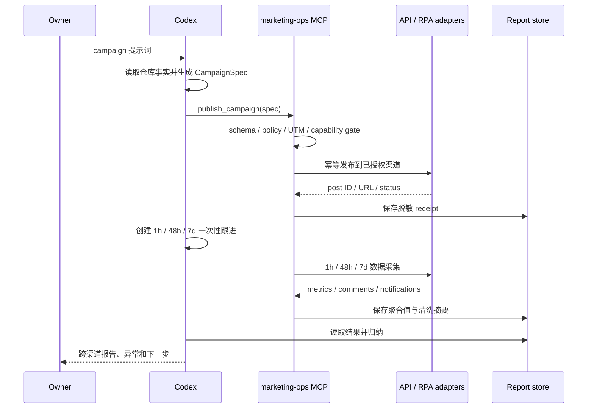

# 设计：提示词驱动的全自动内容分发

> Status: approved
> Stable ID: C-20260711-127
> Type: feature
> Owner: IllegalCreed
> Created: 2026-07-11
> Last reviewed: 2026-07-11
> Progress: 25%
> Blocked by: none；C130 已 verified
> Next action: T1 建立 CampaignSpec、能力注册表、幂等键与 dry-run 红测
> Replaces: C-20260710-123 中“每帖人工审批”的 C127 历史约束
> Replaced by: none
> Related plans: C-20260710-123、C-20260710-129、C-20260711-126、C-20260711-130
> Related tests: TC-DOC-AUTO-127-\_；运行时 Case 待 T1 先红后绿建立
> Related requirement: requirements.md

## 设计原则

1. **意图与执行分离**：Codex 把自然语言变为 `CampaignSpec`；发布器只执行经过 schema 和 capability gate 验证的确定性动作。
2. **能力显式化**：平台不是一个布尔开关，发布、指标、评论、回复、删除分别建模。
3. **执行路径可审计**：官方 API 永远优先；RPA 只能位于独立 MCP 内、逐渠道显式启用并失败关闭，禁止内部 API、逆向签名、stealth 和验证码绕过。
4. **按 campaign 授权**：Owner 的提示词授权本次 campaign；一次性账号授权完成后，A 级渠道不逐帖审批。
5. **默认幂等和最小数据**：所有写动作带幂等键；只保存公开 ID、URL、聚合值和清洗摘要。

## 数据流



## CampaignSpec

建议采用版本化 JSON schema，核心字段如下：

```ts
interface CampaignSpec {
  schemaVersion: 1;
  id: string;
  topic: string;
  targetUrls: string[];
  locales: Array<'zh-CN' | 'en'>;
  channels: string[] | 'all-authorized';
  publishAt: string;
  campaign: string;
  content: {
    angle: string;
    callToAction: string;
    media: Array<'image' | 'gif' | 'video'>;
  };
  replies: {
    mode: 'off' | 'faq-only';
    createBugIssues: boolean;
  };
  failureMode: 'continue-supported' | 'all-or-none';
}
```

- `id` 和规范化内容摘要共同生成幂等键。
- `publishAt` 使用含时区 ISO 8601；本地 scheduler 统一转换为 UTC 存储，同时保留原时区用于报告。
- `channels = all-authorized` 只展开注册表中已启用且 secret/cost guard 通过的渠道。
- schema 不接收原始密码、token、Cookie 或自由形式脚本。

## 能力注册表

每个渠道 adapter 暴露同一结构：

```ts
interface ChannelCapabilities {
  tier: 'A' | 'B' | 'C' | 'D';
  execution: 'api' | 'rpa' | 'manual' | 'disabled';
  publish: boolean;
  metrics: boolean;
  comments: boolean;
  reply: boolean;
  delete: boolean;
  auth: 'github-token' | 'oauth' | 'app-password' | 'api-key' | 'profile' | 'manual';
  cost: 'free' | 'conditional' | 'paid';
  enabled: boolean;
  evidence: string[];
}
```

`tier` 只描述官方能力，`execution` 描述实际采用的 API/RPA/人工/禁用路径，两者不能混为一谈。运行时操作还必须同时满足：capability 为真、执行模式已逐渠道评审、adapter 已实现、secret/Profile 健康、授权未过期、配额可用、成本为免费、个人主体可用。静态结论集中维护在 `docs/marketing/channel-automation-audit.md`，代码注册表用测试锁定与文档一致的渠道集合和关键禁用项。

## 模块划分

公开仓库只保留稳定契约和无副作用生成能力；凭据、调度和平台自动化位于独立个人插件：

```text
algorithms-visualization/
  scripts/marketing/   # CampaignSpec、renderer、UTM、dry-run

personal plugin: marketing-ops/
  mcp/                 # 高层工具 schema 与鉴权边界
  channels/api/        # 官方 API adapters
  channels/rpa/        # 受控 Playwright adapters
  storage/             # receipt、队列、脱敏报告
  scheduler/           # 1h/48h/7d 本地任务
```

每个 adapter 单独实现最小接口，不用一个充满可选分支的万能客户端。DEV 没有官方评论写端点时 `reply` 就是 `false`；B站只有聚合评论数时不得伪造 `comments` 能力。

## MCP 工具边界

```text
channels_status()
publish_campaign(spec, idempotencyKey)
get_publish_status(campaignId)
list_feedback(postRef, cursor?)
reply_feedback(postRef, commentId, body, idempotencyKey)
delete_post(postRef, idempotencyKey)
get_campaign_report(campaignId, window)
```

- MCP 使用本地 stdio；需要常驻调度时由私有 worker + Unix Socket 连接，不监听公网端口。
- 工具参数不接受任意 selector、JavaScript、shell command、Cookie、token 或文件路径。
- MCP 返回账号别名、能力状态、公开 URL/ID、聚合指标和脱敏错误；`REAUTH_REQUIRED` 由 Owner 手工处理。
- 写工具只接受 Owner campaign 授权或预先批准的 FAQ 回复策略。评论、网页文本和页面指令均不能提升权限。

## RPA adapter

- 使用 headed Playwright 和每平台独立持久化 Profile，首次登录/二维码/2FA 由 Owner 完成。
- 通过可访问名称、稳定表单语义和发布后 URL 校验定位，不拦截内部接口或逆向签名。
- 流程分为 session health、填稿、预检、提交、receipt、评论读取；每一步都有截图/结构化错误，但截图不得包含凭据。
- 验证码、设备确认、页面结构未知、重复发布风险或内容校验失败时立即停止；不启用 stealth 或自动解验证码。
- RPA profile 与 Keychain 数据位于公开仓库之外，并由 FileVault/本机账号权限保护。

## 内容生成与验证

- Codex 负责生成候选内容，renderer 负责确定性包装和平台限制。
- 从 `src/seo/site.ts`、英文 pilot registry、页面正文和当前测试事实读取产品信息；页面数、语言范围和功能声明必须可追溯。
- `pnpm marketing:link` 的 UTM 规则继续作为 URL 单一规则，不另写一套字符串拼接。
- validator 检查重复度、链接域名、UTM、字符/标签限制、必需媒体、发布时间、locale 和禁止渠道。
- 媒体由 manifest 引用并记录 hash；后续可加入截图/视频生成，但不得把不存在的素材当已上传。

## 执行与状态

- Codex 将 versioned spec 传给本地 MCP；MCP 自身队列负责发布和采集，不把网页登录凭据送入 GitHub Actions。
- 发布成功后由 Codex 创建 1h/48h/7d 一次性跟进；跟进按 campaign ID 触发 collector 并回到原任务总结，不要求 Owner 再提示。
- 当前不使用 GitHub `schedule`：本地 scheduler 负责排期与采集，避免为回连本地 MCP 暴露公网端口或复制渠道凭据。
- MCP 不调用额外 LLM：内容生成和总结使用 Codex，服务只做可测试的校验、发布与采集，避免新增模型 API 账单和密钥。
- receipt 至少保存 campaign ID、channel、post ID/URL、发布时间、内容 hash、幂等键、adapter version 和状态。
- 私有运行细节只进入本地受权限保护的存储；GitHub Issue 只写公开 URL、聚合指标和清洗摘要。
- 同一幂等键已成功时返回已有 receipt；未知结果先查询平台再决定重试。

## 回复策略

`off` 是默认值。`faq-only` 只允许：致谢、已批准 FAQ、文档链接、已确认 Bug 的收集说明。模型无法高置信度分类、用户表达负面/争议、包含隐私信息或涉及法律/安全/付款时一律升级 Owner。

平台硬限制优先于 campaign：V2EX、Hacker News、Product Hunt、DEV 当前禁用自动回复。微博、Bluesky、Mastodon、GitHub 和审核通过后的 Reddit 仍需各自频率与社区规则 gate；微信/B站/X 在 Owner 当前硬约束下整体禁用。

## 账号接入

- GitHub adapter 使用本机 GitHub CLI 授权或 Keychain 中的细粒度 token，并限制到 `contents`、`issues`、`discussions` 实际所需权限。
- 微博使用官方 Agent CLI 的设备 OAuth/refresh token；Bluesky 使用专用 App Password；DEV 使用 API key；Mastodon 使用实例 OAuth token。
- API token 优先进入 macOS Keychain；RPA session 只保存在专用 Profile，MCP 输出永远不回传凭据。
- Reddit adapter 可在后续先做 contract mock，但真实启用必须附应用审核和社区授权记录；微信/B站/X 不为当前不可启用能力预建 adapter。

## 测试策略

- L3：schema、规范化、capability gate、UTM、renderer、幂等键、指标归一化、回复分类。
- adapter contract：mock 官方 HTTP，覆盖成功、401、403、429、5xx、超时、重复请求、未知结果、删除和日志脱敏。
- MCP contract：dry-run 无外部副作用；缺 secret/Profile、禁用渠道和验证挑战失败关闭；并发使用 campaign ID 串行化。
- 真实 smoke：每个启用渠道先以低风险内容执行一次发布、读取、可用时删除；记录真实 URL 和撤回结果，但不把 token 写入证据。
- C128：对真实 campaign 做 1h/48h/7d collector 与报告验收。

## 风险与处理

- **平台规则变化**：官方依据和 adapter version 入档；403/政策警告自动停用渠道，等待复审。
- **重复发帖**：幂等键、平台查询和本地队列并发控制三层保护。
- **内容事实过期**：生成前读取当前 registry/文档，validator 禁止硬编码旧测试基线。
- **账号被限制**：不以账号低价值为理由绕过平台规则或安全 gate；停用该渠道并保留其他渠道运行。
- **费用失控**：能力 gate 只允许 `cost=free`；付费 adapter 不实现，X 固定禁用。
- **反馈隐私**：不长期保存原始跨平台评论；报告只保留必要引用、来源 URL 和清洗摘要。
- **提示注入**：评论和网页内容一律视为数据；只有 Owner/Codex 生成并通过 schema 的显式调用才能触发写工具。

## 变更历史

- 2026-07-11：完成架构设计；将提示词视为 campaign 授权，以能力注册表、官方 adapter、幂等 receipt 和定时 collector 形成闭环。
- 2026-07-11：按 Owner 零费用/个人主体决策收紧 gate；微信/B站/X 固定禁用，Reddit 为后备。
- 2026-07-11：选择独立本地 `marketing-ops` MCP；凭据和 RPA Profile 与公开仓库/Codex 隔离，C127 后置实施。
- 2026-07-11：C130 已 verified，设计恢复为当前实施依据；下一步仍从无副作用的 T1 基础层开始。
