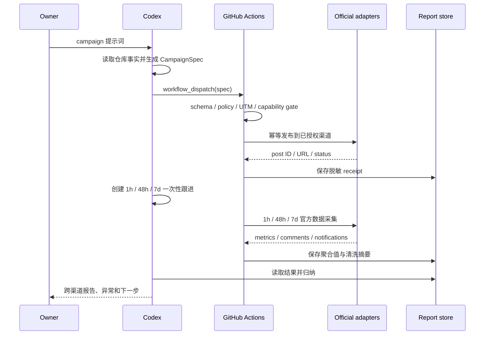

# 设计：提示词驱动的全自动内容分发

> Status: implementing
> Stable ID: C-20260711-127
> Type: feature
> Owner: IllegalCreed
> Created: 2026-07-11
> Last reviewed: 2026-07-11
> Progress: 20%
> Blocked by: 首批站外账号尚未完成官方 token/OAuth 接入；不阻塞本地基础层实现
> Next action: T1 实现 CampaignSpec、能力注册表、renderer 与 dry-run
> Replaces: C-20260710-123 中“每帖人工审批”的 C127 历史约束
> Replaced by: none
> Related plans: C-20260710-123、C-20260710-129、C-20260711-126
> Related tests: TC-DOC-AUTO-127-\_；运行时 Case 待 T1 先红后绿建立
> Related requirement: requirements.md

## 设计原则

1. **意图与执行分离**：Codex 把自然语言变为 `CampaignSpec`；发布器只执行经过 schema 和 capability gate 验证的确定性动作。
2. **能力显式化**：平台不是一个布尔开关，发布、指标、评论、回复、删除分别建模。
3. **官方路径唯一**：每个 adapter 必须链接官方依据；缺能力时失败关闭，不设置浏览器/内部 API fallback。
4. **按 campaign 授权**：Owner 的提示词授权本次 campaign；一次性账号授权完成后，A 级渠道不逐帖审批。
5. **默认幂等和最小数据**：所有写动作带幂等键；只保存公开 ID、URL、聚合值和清洗摘要。

## 数据流



## CampaignSpec

建议采用版本化 JSON schema，核心字段如下：

```ts
interface CampaignSpec {
  schemaVersion: 1;
  id: string;
  topic: string;
  targetUrls: string[];
  locales: Array<'zh-CN' | 'en'>;
  channels: string[] | 'all-authorized';
  publishAt: string;
  campaign: string;
  content: {
    angle: string;
    callToAction: string;
    media: Array<'image' | 'gif' | 'video'>;
  };
  replies: {
    mode: 'off' | 'faq-only';
    createBugIssues: boolean;
  };
  failureMode: 'continue-supported' | 'all-or-none';
}
```

- `id` 和规范化内容摘要共同生成幂等键。
- `publishAt` 使用含时区 ISO 8601；GitHub schedule 仍以 UTC 执行。
- `channels = all-authorized` 只展开注册表中已启用且 secret/cost guard 通过的渠道。
- schema 不接收原始密码、token、Cookie 或自由形式脚本。

## 能力注册表

每个渠道 adapter 暴露同一结构：

```ts
interface ChannelCapabilities {
  tier: 'A' | 'B' | 'C' | 'D';
  publish: boolean;
  metrics: boolean;
  comments: boolean;
  reply: boolean;
  delete: boolean;
  auth: 'github-token' | 'oauth' | 'app-password' | 'api-key' | 'manual';
  cost: 'free' | 'conditional' | 'paid';
  enabled: boolean;
  evidence: string[];
}
```

运行时操作还必须同时满足：capability 为真、adapter 已实现、secret 存在、授权未过期、配额可用、成本 guard 通过。静态等级结论集中维护在 `docs/marketing/channel-automation-audit.md`，代码注册表用测试锁定与文档一致的渠道集合和关键禁用项。

## 模块划分

计划按仓库现有 TypeScript/Vitest 习惯实现为 build-time 工具，不进入 SPA bundle：

```text
scripts/marketing/
  campaign.ts          # schema、规范化、幂等键
  capabilities.ts      # 渠道注册表与 gate
  renderers/           # 渠道原生内容
  adapters/            # 官方发布/读取实现
  collectors/          # 1h/48h/7d 标准化采集
  reports/             # 脱敏报告与 Issue 分流
  cli.ts               # dry-run/publish/collect
.github/workflows/
  marketing.yml        # workflow_dispatch + 后续 schedule
```

每个 adapter 单独实现最小接口，不用一个充满可选分支的万能客户端。DEV 没有官方评论写端点时 `reply` 就是 `false`；B站只有聚合评论数时不得伪造 `comments` 能力。

## 内容生成与验证

- Codex 负责生成候选内容，renderer 负责确定性包装和平台限制。
- 从 `src/seo/site.ts`、英文 pilot registry、页面正文和当前测试事实读取产品信息；页面数、语言范围和功能声明必须可追溯。
- `pnpm marketing:link` 的 UTM 规则继续作为 URL 单一规则，不另写一套字符串拼接。
- validator 检查重复度、链接域名、UTM、字符/标签限制、必需媒体、发布时间、locale 和禁止渠道。
- 媒体由 manifest 引用并记录 hash；后续可加入截图/视频生成，但不得把不存在的素材当已上传。

## 执行与状态

- `workflow_dispatch` 接收 versioned spec 或 artifact 引用；发布 job 使用 GitHub Environment 隔离 secrets。
- 发布成功后由 Codex 创建 1h/48h/7d 一次性跟进；跟进按 campaign ID 触发 collector 并回到原任务总结，不要求 Owner 再提示。
- GitHub `schedule` 只作为大量活跃 campaign 的后续扩展或恢复兜底，不让定时任务自由生成新 campaign。
- GitHub Actions 不调用 LLM：内容生成和总结使用 Codex，workflow 只做可测试的校验、官方 API 调用与采集，避免新增模型 API 账单和密钥。
- receipt 至少保存 campaign ID、channel、post ID/URL、发布时间、内容 hash、幂等键、adapter version 和状态。
- 可将私有运行细节保存在受权限保护的 Actions artifact；GitHub Issue 只写公开 URL、聚合指标和清洗摘要。
- 同一幂等键已成功时返回已有 receipt；未知结果先查询平台再决定重试。

## 回复策略

`off` 是默认值。`faq-only` 只允许：致谢、已批准 FAQ、文档链接、已确认 Bug 的收集说明。模型无法高置信度分类、用户表达负面/争议、包含隐私信息或涉及法律/安全/付款时一律升级 Owner。

平台硬限制优先于 campaign：V2EX、Hacker News、Product Hunt、DEV 当前禁用自动回复；B站在缺少官方评论正文接口时也禁用。微博、Bluesky、Mastodon、GitHub、符合资质的微信/Reddit 仍需各自频率与社区规则 gate。

## 账号接入

- GitHub 使用 workflow 的最小权限 `GITHUB_TOKEN`，明确声明 `contents`、`issues`、`discussions` 所需权限。
- 微博使用官方 Agent CLI 的设备 OAuth/refresh token；Bluesky 使用专用 App Password；DEV 使用 API key；Mastodon 使用实例 OAuth token。
- token 只进入 Environment Secrets；日志只输出 secret 名称是否存在，不输出值或可逆片段。
- 条件渠道的 adapter 可先 mock 实现，但真实启用必须附平台审核/资质状态记录。

## 测试策略

- L3：schema、规范化、capability gate、UTM、renderer、幂等键、指标归一化、回复分类。
- adapter contract：mock 官方 HTTP，覆盖成功、401、403、429、5xx、超时、重复请求、未知结果、删除和日志脱敏。
- workflow：dry-run 无外部副作用；缺 secret/禁用渠道失败关闭；并发使用 campaign ID 串行化。
- 真实 smoke：每个启用渠道先以低风险内容执行一次发布、读取、可用时删除；记录真实 URL 和撤回结果，但不把 token 写入证据。
- C128：对真实 campaign 做 1h/48h/7d collector 与报告验收。

## 风险与处理

- **平台规则变化**：官方依据和 adapter version 入档；403/政策警告自动停用渠道，等待复审。
- **重复发帖**：幂等键、平台查询和 workflow concurrency 三层保护。
- **内容事实过期**：生成前读取当前 registry/文档，validator 禁止硬编码旧测试基线。
- **账号被限制**：不以账号低价值为理由绕过官方路径；停用该渠道并保留其他渠道运行。
- **费用失控**：付费 adapter 默认禁用，必须有单次和月度预算 guard；X 不进入 v1。
- **反馈隐私**：不长期保存原始跨平台评论；报告只保留必要引用、来源 URL 和清洗摘要。

## 变更历史

- 2026-07-11：完成架构设计；将提示词视为 campaign 授权，以能力注册表、官方 adapter、幂等 receipt 和定时 collector 形成闭环。
