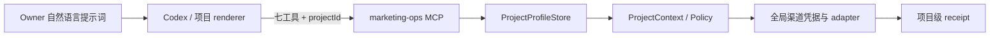

# 设计：marketing-ops 多项目隔离与通用化

> Status: verified
> Stable ID: C-20260727-133
> Type: feature
> Owner: IllegalCreed
> Created: 2026-07-27
> Last reviewed: 2026-07-27
> Progress: 100%
> Blocked by: none
> Next action: 已完成；返回 C127，先撤销暴露的 Mastodon token，再用隐藏输入完成 setup/identity smoke
> Replaces: none
> Replaced by: none
> Related plans: C-20260711-127
> Related tests: TC-AUTO-PROJECT-133-\_、TC-AUTO-CONTRACT-133-\_、TC-AUTO-ISOLATION-133-\_、TC-AUTO-TARGET-133-\_、TC-AUTO-GITHUB-133-\_、TC-AUTO-DEV-133-\_、TC-AUTO-MIGRATION-133-\_、TC-AUTO-CLI-133-\_、TC-AUTO-BRIDGE-133-\_、TC-AUTO-PLUGIN-133-\_
> Related requirement: requirements.md

## 总体结构



凭据按渠道全局保存，目标与回执按项目隔离。MCP 不信任调用方传入的仓库、origin 或标签，而是用 `projectId` 读取本机 profile，形成只读 `ProjectContext` 后再构造 adapter。

## Project Profile

```ts
interface ProjectProfile {
  schemaVersion: 1;
  id: string;
  displayName: string;
  canonicalOrigins: string[];
  channels: ChannelId[];
  github?: {
    repository: string;
  };
  dev?: {
    tags: string[];
  };
}
```

- 路径：`<dataRoot>/projects/<projectId>.json`。
- `projectId` 使用小写 kebab-case；文件名只由通过校验的 ID 派生。
- origin 规范为无路径、query、hash、userinfo 的 HTTPS origin。
- GitHub repository 固定为 `owner/name`；DEV tags 为 1 至 4 个小写安全 token。
- store 对根目录和文件执行权限、普通文件、非 symlink、schema 与 ID/文件名一致性检查。

## 契约与请求边界

`MCP_CONTRACT_VERSION` 升到 `3`。七个工具的顶层 input schema 都新增必填 `projectId`，并保持 `additionalProperties=false`。`publish_campaign` 的 renderer package 仍由公开项目生成；插件只验证 package 与 profile，不复制项目文案规则。

运行时处理顺序：

1. 严格解析 MCP 输入并拒绝危险字段；
2. 读取 `projectId` 对应 profile；
3. 校验请求渠道和所有 URL 是否落在 profile 边界；
4. 从 profile 创建 project-scoped adapter/controller；
5. 用项目级幂等键查询或写入 receipt；
6. 执行平台动作并返回脱敏结果。

## 隔离键与存储

- 幂等键：`campaign-v3/<projectId>/<campaignId>/<channel>/<contentDigest>`。
- 新 receipt schema 为 v2，新增 `projectId`；文件索引与查询都以 `projectId` 为第一维。
- GitHub tag：`marketing/<projectId>/<campaignId>`，远端 marker 同时包含 project ID、campaign ID 与 idempotency key。
- GitHub activation：`activations/github/<projectId>.json`；Bluesky、DEV、Mastodon 等账号 activation 保持渠道全局。
- 所有项目级查询必须先匹配 receipt 的 `projectId`，再匹配 campaign/channel/postRef。

## URL 与平台策略

- `isAllowedProjectUrl(profile, url)` 比较规范化 `URL.origin`，不接受子域猜测、HTTP、userinfo 或前缀字符串匹配。
- GitHub adapter 的 repository 只能从 `profile.github.repository` 获得。
- DEV adapter 构造参数接收 profile 的 canonical origins 和 tags；正文 package 的 canonical URL 及所有项目链接逐项校验。
- 其他 adapter 继续复用全局账号凭据，但 receipt 与请求仍按项目隔离。

## 兼容方案

- 通过 CLI 注册 `algorithm-visualizer` profile。
- receipt parser 同时接受 v2 与既有 v1；v1 只允许通过显式 legacy project mapping 归属 `algorithm-visualizer`，读取后可按需原子升级，禁止猜测任意项目。
- 旧 `activations/github.json` 只有在 repository 与 profile 完全一致时才能迁移到项目文件；不匹配或多项目歧义时要求重新执行该项目的 GitHub setup。
- 全局 Bluesky/DEV/Mastodon activation 和 Keychain key 不改名，避免无意义 secret 迁移。

## CLI

第一阶段命令面：

```text
marketing-ops project add
marketing-ops project list
marketing-ops project show <project-id>
marketing-ops setup github --project <project-id>
marketing-ops status --project <project-id>
marketing-ops doctor --project <project-id>
```

`project add` 使用交互提示或严格选项完成非秘密字段录入；正常 campaign 仍由 Codex 通过 MCP 执行，Owner 不需要记忆这些命令。

## 安全边界

- profile 是非秘密配置，但仍按 `0600` 防止本地篡改目标。
- 不接受 MCP 侧任意 repository、origin、tags、path 或 command 覆盖。
- profile/receipt/activation 的符号链接、宽松权限、损坏 schema 与跨项目不匹配全部失败关闭。
- 被暴露的 Mastodon token 不进入命令、日志、测试 fixture、git 历史或 profile。

## 测试策略

- 本地插件 L3：store、policy、contract、receipt、runtime、adapter、migration 与 CLI。
- 公开仓库 L3：契约镜像与 Algorithm Visualizer payload bridge。
- MCP：七工具 stdio smoke，验证 project ID 必填与输出脱敏。
- 安全代码：profile/path/policy/receipt migration 维持行与分支 100%。
- 无 UI 行为变化，因此 C133 不新增站点 L4/L5；完整回归由公开仓库 `pnpm verify` 守护。
